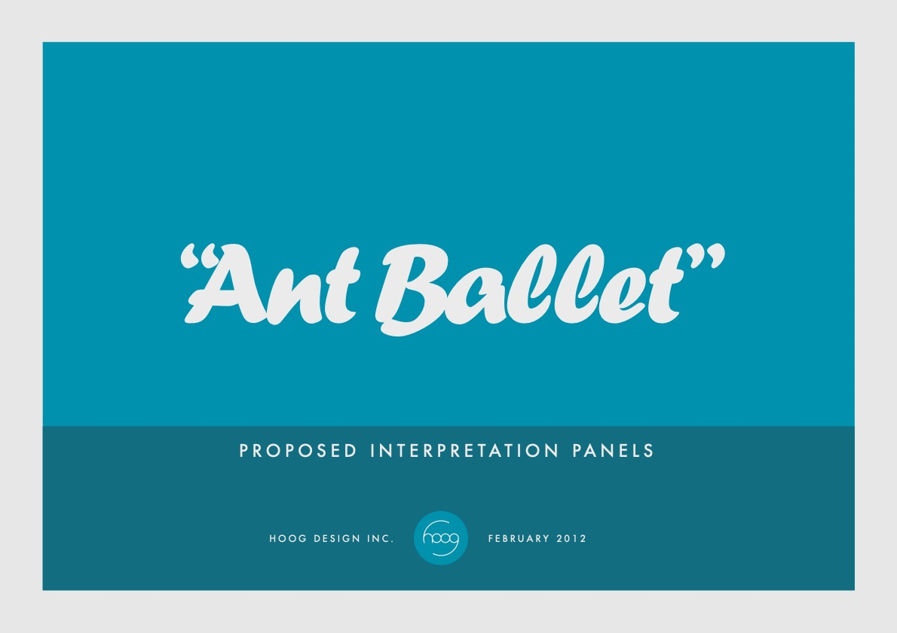

testing links

without trailing slash

[6](../../1_Chapters/ch1)

[6](../../1_Chapters/ch1/)

to ../images

<figure>
  
</figure>

# Abstract

‘Scripting’ in architecture is usually associated with computer-based design programming. However, this narrow usage belies a rich vein of concepts intrinsic to architecture and authorship. This thesis frames scripting as a critical mode of computation, performance, and design process. It does this through seven projects that explore relationships between technology, society, and the philosophical absurd. Works include films, performances, programmes and installations produced independently and collaboratively with experts from scientific and artistic fields.

This thesis asks: how might an expanded definition of ‘scripting’ act as a critical methodology for performative architectural design?; how can this methodology mediate between, and comment on, technology and society?; and what is the relationship between scripting, authorship and agency? Computational scripting has been explored in depth by a number of practitioners and theorists; performative scripting has been examined within the context of theatre and artistic practice; this study adopts an expansive definition of scripting that embraces each of these approaches whilst simultaneously proposing scripting as a critical design methodology. Furthermore, the thesis introduces the philosophical ‘absurd’ as a framework for critiquing emergent technologies and their impact on society.

In [Chapter 1](../../1_Chapters/ch1/), two projects (Ant Ballet, Godot Machine) are discussed as modes of diagramming absurd theatrical scripts. The ‘framing’ of these projects provides direction for further work within the thesis. [Chapter 2](../../1_Chapters/ch2/) introduces two dance pieces (Nybble, Scriptych) which represent scripted performances and a novel computer-scripted feedback mechanism. Both are diagrammatic modes of presenting contemporary computing mechanisms. [Chapter 3](../1_Chapters/ch3/) then discusses two experimental computationally-scripted absurd films exploring the practices and impact of contemporary technology companies (86400, 24fps Psycho).

[Chapter 4](../1_Chapters/ch4/) introduces a film (Network / Intersect) created through a novel design process imposing strict rules on the creation of work. It concludes by naming this practice ‘reflexive scripted design’, proposing it as the thesis’ main original contribution to knowledge.
