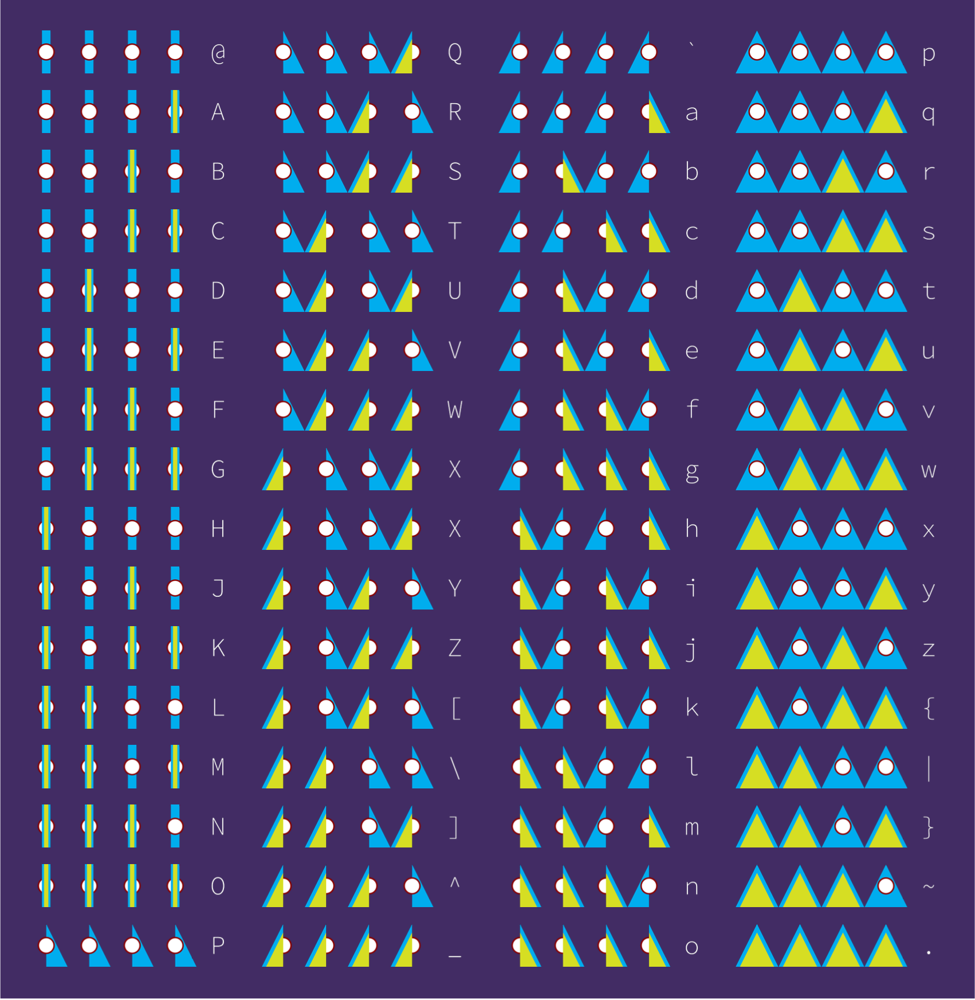
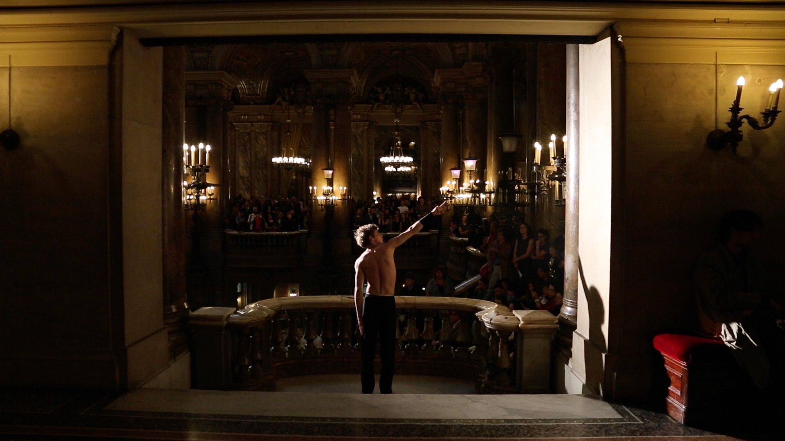
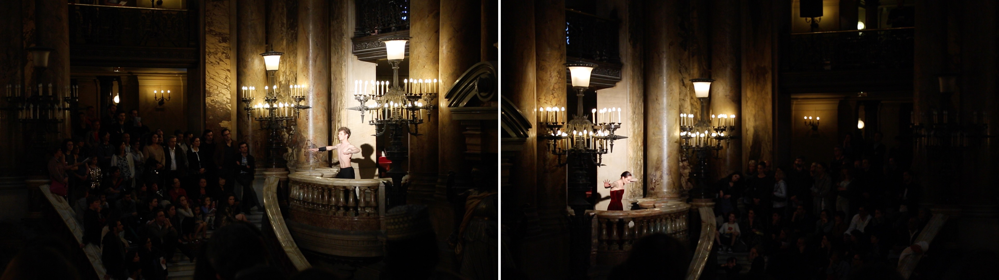
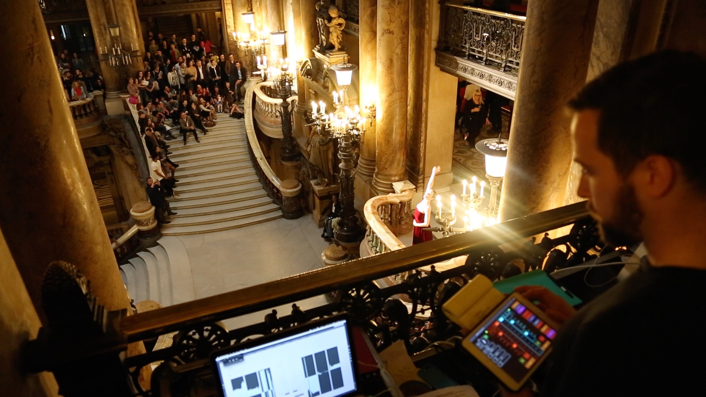
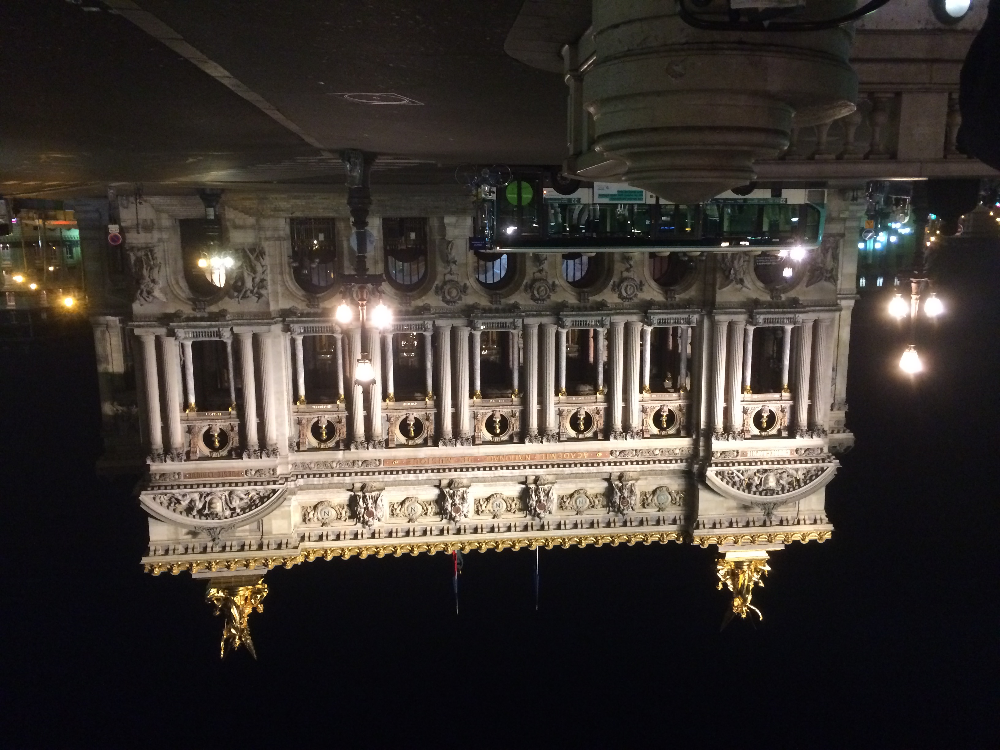
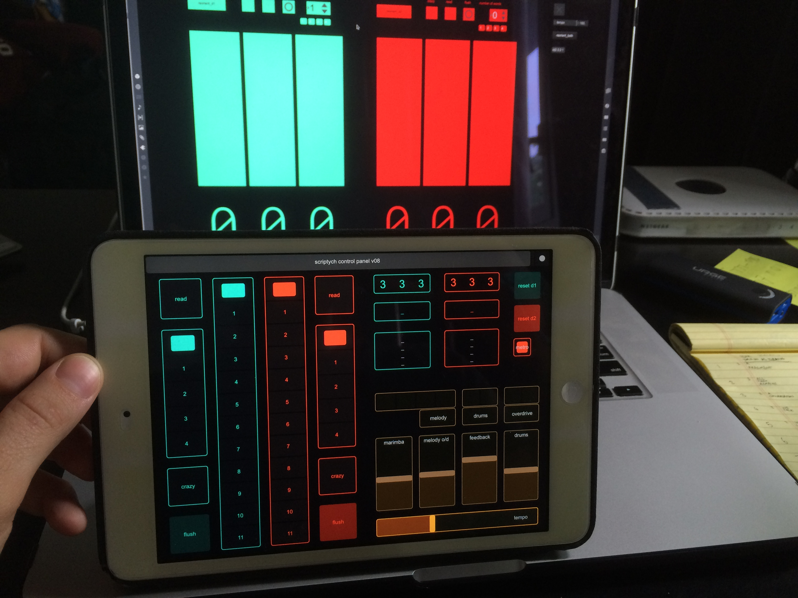
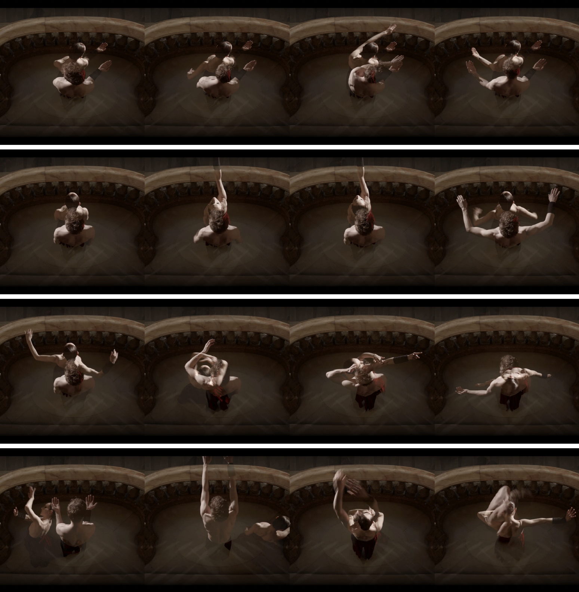

# Chapter 2: Performing Data Structures

<h1><a href="#nybble">Nybble</a> and <a href="#scriptych">Scriptych</a></h1>

----

## Overview

> Computation is central to the contemporary built environment, yet the underlying principles of computing are not widely known by the general public (as highlighted by recent debates in the media about advances in artificial intelligence research). This chapter presents a pair of novel design projects which use dancers to show computational processes in the form of diagrammatic performances. Nybble is a performance which acts as a diagram of John Searle's Chinese Room argument against hard artificial intelligence; Scriptych consists of dancers interacting with a three-dimensional database of words. Scripting is used as a mode of instruction for performers in both performances, with direct computer-scripted feedback provided via a novel interface in Scriptych. This advances the notion of script as mode of performance-instruction in the context of this thesis, as well as demonstrating computer scripting as a mode of interaction. It finds that the notion of performance-script can be used to drive performances at various stages the design process, representing different levels of agency for performers.

----

## Nybble videos

V&A Museum | 21-22 September 2013

<h3>Nybble: project video</h3>

<iframe src="http://player.vimeo.com/video/216712681" width="640" height="360" frameborder="0" webkitallowfullscreen="" mozallowfullscreen="" allowfullscreen=""></iframe>

<h3>Nybble: code base</h3>

<iframe src="http://player.vimeo.com/video/216712602" width="640" height="360" frameborder="0" webkitallowfullscreen="" mozallowfullscreen="" allowfullscreen=""></iframe>

<h3>Nybble: timelapse 1</h3>

<iframe src="http://player.vimeo.com/video/216712752" width="640" height="360" frameborder="0" webkitallowfullscreen="" mozallowfullscreen="" allowfullscreen=""></iframe>

<h3>Nybble: timelapse 2</h3>

<iframe src="http://player.vimeo.com/video/216712824" width="640" height="360" frameborder="0" webkitallowfullscreen="" mozallowfullscreen="" allowfullscreen=""></iframe>

----

## Scriptych videos

Opéra Garnier de Paris | 17-18 June 2016

<h3>Scriptych: project video</h3>

<iframe src="http://player.vimeo.com/video/243660552" width="640" height="360" frameborder="0" webkitallowfullscreen="" mozallowfullscreen="" allowfullscreen=""></iframe>

<h3>Scriptych: making of (INA)</h3>

<iframe src="http://player.vimeo.com/video/216794684" width="640" height="360" frameborder="0" webkitallowfullscreen="" mozallowfullscreen="" allowfullscreen=""></iframe>

Video by Institut national d'Audiovisuel (INA)
© INA 2016


----

## Introduction

Much of my design practice involves computer scripting. In the previous chapter, I described two projects which relied heavily on computer scripting: *Ant Ballet* used an inverse-kinematics programme to drive its robot arm and spread pheromones; the *Godot Machine* used a programme which used computer vision to drive the movement of a ball.[^1] Chapter 3 introduces two projects where I used scripting to generate new films, *86400* and *24fps Psycho* from archival footage.[^2] I regard the act of writing code itself a design process: it requires a mode of thought that is procedural and concentrated; it is distinct from drawing, yet offers a similarly iterative process of refinement and improvement. This chapter will discuss the way in which designers, and in particular I, think *about code* and think *in code*. It begins with an introduction to principles of code writing, and a couple of precedents of diagramming code used by Italo Calvino and Alan Turing. It then presents two projects that form part of my research and design portfolio as part of this PhD, both of which use different principles and methodologies to frame a conversation about thinking about code.

My introduction to writing code (besides playing around with website creation in the early 2000s) came when I joined the Bartlett. I took a series of classes in the Interactive Architecture Lab which introduced me to two languages which I would then use for almost every project for the next few years: Processing and Arduino. Both languages are open-source, and were specifically written to enable artists and designers easy access to higher-level computer compiling languages and microcontrollers. Both also call their files ‘sketches’ – a tactical decision which both unites digital and analogue practices. The ‘sketch’ (rather than, say, file, script, document, or programme) contains clear implicit meaning: firstly, that code itself need not be daunting, and writing a prototypical piece of code should be as natural as drawing on paper. Secondly, the nomenclature aims to position writing code squarely into the early stages of design process, rather than being an extra thing to think about after the designing is done. Both languages offer exactly the promises Oosterhout described in his article on scripting, and these languages acted as a bridging tool for me to learn more advanced modes of programming.[^3]

The form of integrated coding I experienced at the Bartlett seems to reflect the pedagogical practices I have witnessed first-hand at several other design schools over the past few years. Today, it is not uncommon to see parametric scripting, small electronic prototypes, applications and websites, or other various coded outcomes to student projects.[^4] As discussed in the introduction to this thesis, some teaching methods relating to particular aspects of scripting culture, namely parametricist design practice, are highly exclusionary, and rely on rote copying-and-pasting of code examples, or rely extensively on particular libraries and algorithms which are then unquestioningly repeated.[^5] But other aspects of the computer-scripting world are relatively easy to inhabit as an autodidact; there are numerous tutorials, example files, libraries, forums, and so on online which can be used to extend pre-existing skills. My own entry to coding was via classes at the Bartlett, but once I knew the basics of a couple of languages, and knew where to look, and what to look for, extending my vocabulary and skillset was simply a matter of investing time. The approach I have to writing code is different to the traditional computer programmer, for whom the aim is often to write lean, efficient code (often for someone else) which performs to the highest standard; my intention is to use code and code-based-thought to investigate, to learn, or to express design intent.

## Code writing and code thinking


In most instances, before I write code, I use a number of diagrammatic techniques to work out what I want the code do. These could be in the form of state transition diagrams, pseudo-code, flow charts, or diagrams of code-based ‘mechanisms’, with labelled inputs, outputs and procedures.[^6] These diagrams are functional sketches; they show a potential solution to some form of data processing. Like working sketches, they are often altered, improved upon, or superseded later in the design process. Their function is to enable me to mentally model what is going to be happening within the computer itself, to interrogate the logic and data-flows, and make improvements before the functions are obfuscated by interdependent lines of code written in a specific language.

Although arguably becoming more central to certain designers’ process, writing code does require modes of practice that are in themselves distinct from other design processes. Code is written in *code* *language*, and like spoken languages, code languages require learning, practice and often an attitudinal change with regards to the way in which things are done. Communities of people who write code are often tribe-line in their allegiance, and code languages tend to impose a mode of working that cause them to be particularly suited to certain ways of working. PHP, a scripting language used primarily on websites, for example, is notorious for quick development (although lamented by many computer programmers for being ‘dirty’);[^7] Python and its associated communities pride themselves on the *Zen of Python* and use terms such as ‘pythonic’ to describe best practice when writing in the language.[^8]

The essential process that one enters when diagramming a computer programme is the mental modelling of the programme they are going to write. In essence, one must think *as* a computer; to understand how at each step the programme will store, retrieve and manipulate symbols, variables, and objects. To draw a linguistic analogy, we might think about the difference between *having* and *being* in English and Spanish. In English, we draw no grammatical distinction between the state of being implicit in human gender, age, activity, or state of sensing (e.g. warm/cold). However, in Spanish, each of these attributes is approached differently:

<a name="table2-2"></a>


| English | Spanish | Spanish-English translation |
|---|---|---|
| I am a man | Soy uno hermano | I am [in the long-term] a man |
| I am thirty years old | Tengo trienta años | I have thirty years |
| I am writing | Estoy escribiendo | I am [in this moment] writing |
| I am a designer | Soy un diseñador | I am [permanently] a designer |
| I am cold | Tengo frio | I have cold |
| I have a headache | Me duele la cabeza | It hurts my head |


<figure>
  <figcaption>Table 2-2:  English / Spanish translations. Source: the author.</figcaption>
</figure>


Whilst in both English and Spanish, the solution to being (or having) cold may be to turn the radiator up, the effect of the temperature rise is expressed differently; in English, it refers to a stat of being (I am cold) and in Spanish the state of being is expressed through a possessed attribute (*Tengo frio*: I have cold). The presence of temporary and permanent states of being (e.g. *estoy* / *soy*) make the quick articulation of a vocation, as opposed to a temporary task, a simple verbal substitution, whereas in English, this would be declared or implied through context. This is a similar nuance to differing modes of computer programming: the object-oriented programmer may create a class of objects that store a variable for coldness (the equivalent of *being* cold), whereas another programming language may create a series of objects where ‘coldness’ is a secondary, external variable (the equivalent of *having* cold). Another may invoke coldness as a state. The differences in the handling of virtual objects, the changing of states and attributes, and the order in which things are processed, all contribute to the utility of a language at certain tasks.

Much of the time in my own practice, I use flow-charts, draw data flows, and write pseudo-code to work out the effect I would like my programme to have. This then allows me to put ‘sample data’ through the virtual programme and see the effect. For example, here is a sample piece of pseudo-code for a thermostat, designed to run continuously:

```
Turning the radiator ON for 5 SECONDS increases the temperature by 1º.
Leaving the radiator OFF for 30 SECONDS decreases the temperature by 1º.

Every 5 SECONDS, read TEMPERATURE:
- If TEMPERATURE less than TARGET, switch radiator ON.
- If TEMPERATURE larger than or equal to TARGET, switch radiator OFF.
```

I would then ‘run’ this code several times on paper, writing down different starting temperatures, and the results as I went along.[^9] Once I was happy that the pseudo-code would deliver my desired results, I would then turn this into real code (the following to be run in Python):

```
target = 18
currentTemp = getTemp()

if (currentTemp < target):
  radiator = 1
else:
  radiator = 0
```

This process is not unusual for a programmer. Pseudo-code and flowcharts formed part of my first code lessons; the methodology is rife online, and anecdotally, every programmer I have spoken to about the subject uses some form of pseudo-coding if they are mounting a complex task.

Another well-known pseudo-coder was Italo Calvino. As discussed in this thesis’ introduction, Calvino was a member of the Oulipo and active experimenter with combinatorial forms of story-writing. Calvino described his early theories of combinatorial writing in his 1967 lecture *Cybernetics and Ghosts*.[^10] Alluding the theory of DNA, which enables ‘the endless variety of living forms’ to be ‘reduced to a combination of certain finite quantities’, he turns the same logic to linguistics:[^11]

> Here again, it is information theory that imposes its patterns. The processes that appeared most resistant to a formulation on terms of number, to a quantitative description, are not translated into mathematical patterns.[^12]

This is perhaps most exemplified with the story the *Burning of the Abominable House.*[^13] In writing this story, which was in itself based on combinatory principles, Calvino effectively *became* the computer, running his pseudo-code instructions line by line to create enough possible permutations to tell the story. His widow, Esther Calvino, recounts:

> There had been a somewhat vague request from IBM: how far was it possible to write a story using the computer? This was in 1973 in Paris when it wasn’t easy to gain access to data processing equipment. Undaunted, Calvino gave the project a Calvino gave the project a great deal of his time, carrying out all of the operations himself. The story was finally published in the Italian edition of *Playboy*. Calvino didn’t really feel this was a problem, although he had originally planned for it to be published in *Oulipo* as an example of *ars combinatoria* and a challenge to his own mathematical abilities.[^14]

The expense of computers did not just create human-computers of Italian writers in the 1970s. Alan Turing, whose 1936 paper *On computable numbers, with an application to the Entscheidungsproblem* set forth the concept of the universal computing machine (the basis of every modern computer), and whose pioneering work developing early computers led to the cracking of the Enigma code (shortening WWII by several years), was himself unable to access a computer in 1951 whilst trying to write a programme that enabled a digital computer to play chess.[^15] Turing was convinced that programming computers to solve complex problems such as playing chess would yield unexpected advances in other sectors:

> Research into the techniques of programming may in fact lead to quite important advances, and help in serious business and economics – perhaps, regrettably, even in the theory of war\[^.\][^16]

His first attempts at writing a chess programme were on paper, without computer, and he tested them by playing friends and secretaries – with Turing playing the role of computer himself, running through the algorithms for each move.[^17] Turing used the concept of computers playing chess to argue the following principle:

> If one can explain quite unambiguously in English, with the aid of mathematical symbols if required, how a calculation is to be done, then it is always possible to programme any digital computer to do that calculation, provided the storage capacity is adequate.[^18]

The idea of becoming a human computer to complete complex mathematical tasks seems absurd<sub>a</sub> today, when so much of our contemporary calculation is done via digital computers. It would seem even more absurd<sub>a</sub> if the person doing the computing is a famous author or one of the originators of computers themselves. But as both Nancy Katherine Hayles and David Allen Grier note, *human computers* (a job predominantly performed by women), were commonplace in the 1930s and 40s.[^19] Carrying out large, often mundane calculations required that banks of women may work together on separate parts of the same task.[^20] It is only in 1946, after the pioneering work of John von Nuemann and Alan Turing, that the term came to mean a non-human device which would calculate. The first OED citation of term ‘computer’ is in fact from 1613, and refers to a person who makes calculations. Grier claims that ‘the start of large-scale scientific research’ now ‘known informally as “big science”’ can be ‘traced to the \[^human\] computing offices of the eighteenth and nineteenth centuries.’[^21]

Today, however, digital computation is increasingly ubiquitous. ‘Cloud-based’ computing, ‘internet of things’, smartphones, and digital assistants such as Google Assistant and Amazon Alexa have all emerged in the past few years, and all bear the promise of extending the reach of computation.[^22] The systems behind Google Assistant and Amazon Alexa in particular are marketed as making use of artificial intelligence and/or machine learning, two widely used terms that are now even commonly <span id="_Ref481774066" class="anchor"></span>found in tabloid news headlines.[^23] Many large-scale consumer technology companies (Google, Apple, Facebook, Amazon, and more) are investing in artificial intelligence research;[^24] machine learning is also at the heart of emerging self-piloting technologies such self-driving cars and delivery drones.[^25] The recent boom in artificial intelligence is not the first; theoretical and practical research in the field has been carried out for at least fifty years. An earlier boom in research in the late 1970s and early 1980s was in part fuelled by researchers such as Minsky, and Schank and Abelson; the subject was so prevalent in the public consciousness that in 1984, the BBC commissioned philosopher John Searle to give their annual Reith Lectures on advances in computing, artificial intelligence, and their potential philosophical ramifications.[^26]

Searle is best known for his Chinese Room argument, which is a ‘refutation of strong artificial intelligence.’[^27] Introduced in a paper entitled *Minds, Brains, and Programs* in 1980, the debate around the implications and validity of the argument still reins today.[^28] The argument was originally posed as a response to researchers such as Schank and Abelson, who advocated that artificial intelligence programmes which could make use of linguistic scene-recognition would in some way be able to express understanding of scenes;[^29] Searle advocates strongly against this viewpoint, arguing that computers will never be able to understand in the way that humans do, even if they can pass the Turing Test.[^30] Searle summarises the argument concisely as follows:

> Imagine a native English speaker, let’s say a man, who knows no Chinese locked in a room full of boxes of Chinese symbols (a data base) together with a book of instructions for manipulating the symbols (the program). Imagine that people outside the room send in other Chinese symbols which, unknown to the person in the room, are questions in Chinese (the input). And imagine that by following the instructions in the program the man in the room is able to pass out Chinese symbols that are correct answers to the questions (the output). The program enables the person in the room to pass the Turing test for understanding Chinese, but he does not understand a word of Chinese.
>
> The point of the argument is this: if the man in the room does not understand Chinese on the basis of implementing the appropriate program for understanding Chinese, then neither does any other digital computer solely on that basis because no computer, qua computer, has anything the man does not have.[^31]

I was drawn to the Chinese Room argument due to its inherently analogue reasoning about the nature of artificial intelligence (the metaphor does not rely on a digital computer *per se*), and the implicit spatial and performative nature of the images elicited by Searle’s description. Through a diagram, purely described in language, Searle is able to make a rational, yet performative argument which challenges pre-existing notions about concepts such as mind and cognition.[^32] *Nybble* is a project I developed which sought to make explicit the diagram Searle described through the participation of a bank of distinctly non-digital *human computers* blindly following instruction. It was performed in a digital festival in 2013. Three years later, *Scriptych* was a project which employed machine learning techniques to create a new mode of interaction with a computer database, using spatial metaphors to think about multi-dimensional data structures. It was performed in the entrance to the Opera Garnier in Paris, by dancers from the Opera – an area not traditionally used for the company’s performances. Both projects made use of dancers and were performances, and both did not make a traditional computer interface (i.e. screen) visible.

Nybble
------


<figure>
  <a name="figure2-13"></a>
  
  <figcaption>Figure 2-13:  Nybble performance at the V&A Museum, September 2013. Photo by Danielle Willkens.</figcaption>
</figure>

In June 2013 I was an exhibitor in the V&A Museum’s Digital Design Weekend. This annual celebration, which I had first attended in 2009, coincided with the final weekend of London Design Festival, in which the V&A were also participants. As such, it attracted large amounts of people interested in both digital culture and design. I was approached by the Digital Programmes Manager, Irini Papadimitriou, with whom I discussed creating a new piece of work to engage people with the concepts *surrounding* computation, rather than showcasing a new piece of computational artwork. Earlier that year, and completely independently, I had been a participant in a workshop run by an Arts and Humanities Research Council (AHRC) research consortium between the V&A Museum and UCL’s Centre for Sustainable Heritage entitled Design with Heritage (DwH). The consortium’s aim was to investigate potential ways in which new and emerging technology could be used to enhance and augment exhibitions and artefacts within museums, and their working method was to gather industry professionals and independent practitioners together in intensive one-day workshops to rapidly identify and propose projects to investigate issues surrounding two topics: potential new methods in which existing and emerging technology could be used to enhance and augment exhibitions and artefacts within museums. I was fortunate to be awarded a small grant to investigate audience navigation in museums, which was used to produce the project that became *Nybble*.

At the time, the concept of artificial intelligence and machine learning was re-entering the public consciousness, and more media coverage was devoted to the subject. I had recently heard about Turing’s chess programme and began my engagement in issues surrounding machine learning and artificial intelligence.[^33] I had also taught students computer programming and electronics via Arduino and Processing, and consistently found that students who were otherwise well-versed in using computers for advanced design purposes were often ill-able to describe the underlying principles of computing, or the lineage of technological and philosophical development which had led to the computers we use every day. It seemed that there was a widespread misconception about what a computer is and does; the focus in media representation of technology is often concerned with the form factor technology adopts (e.g. the specifications and aesthetics of a new gadget) rather than the wider ramifications of what it can do, and how this affects society. Turing’s influential papers on computation, and even his early experiments with chess programmes, and even Searle’s arguments about artificial intelligence, had been conducted without the use of a computer, yet the work of both continues to resonate today. I wanted to create a work Digital Design Weekend where computation was on display, but a digital computer was not.

I decided that an exhibition whereby a bank of humans could act out the inner workings of a computer, much like Calvino and Turing had done, would be an interesting way to present computation. The humans would form part of a huge computer, calculating something that only an audience would see; thus, the human computers inside the installation, would be acting out Searle’s Chinese Room argument. This would be a larger-scale version of the type of diagramming that I had previously attempted with the *Godot Machine* and *Ant Ballet*. The performance would also extend my work into the world of the Absurd, though through an inversion of the traditional Absurdist performance; if the absurd<sub>b</sub> is constructed through an ultimately doomed quest to find meaning in a universe devoid of it (in theatre, usually occurring through an initial establishment of normalcy followed by an entropic descent into meaninglessness), this piece would appear devoid of meaning for its performers and audience without a ‘key’, yet deliver an arbitrary message to those determined enough to persist and try to crack the code.

This structure was influenced by the arguably absurd<sub>b</sub> 1959 novel the *The* *Sirens of Titan* by Kurt Vonnegut.[^34] The punch-line of the sci-fi story is that the whole of humanity’s development and progress – technology, languages, religions, and culture – have in fact been mysteriously influenced by forces from afar, in order that an elaborate and highly specific life-trajectory would be taken by one man, resulting in war on earth and mass destruction – all so that one small part of a broken machine on Mars would be replaced, enabling it to continue its journey across the universe to deliver a message. Finally, it is revealed that the message itself consists of a single point, meaning ‘Greetings’ in its native language.[^35] Although smaller in scale, and notably devoid of conspiracy theory-paranoia, this project would ask audience and participants to decode something that tested the limits of their perception (and patience), yet itself conveyed a meaningless message, echoing the absurd<sub>b</sub> assertion that humanity is doomed to search for meaning in a universe devoid of it. Many of the concepts surrounding this idea were the result of conversations with colleagues in who shared a studio, co-tutors, my PhD supervisors, and my frequent collaborator, Abi Palmer.

### Methodology

Please note, for the sake of clarity, the project is presented here in thematic, rather than strictly chronological order. Much of the project development, as with most projects I work on, occurred concurrently as a result of the design process.

Early on in the design process, I began researching the mechanics of computation. The part of a computer that is most similar to the process that the Chinese Room argument describes is the Central Processing Unit (CPU). The primary function of computers is to interpret and manipulate symbols; and in order to process information in the correct order, a precise timing mechanism is required. This acts as a synchronisation and sequencing device that ensures information is processed in the right order.

The process of parsing characters from binary information held in a computer’s memory to symbols occurs every time a character is displayed on a computer screen. In essence, it is the most basic process a computer can do. At the simplest level, a sentence stored in computer memory is a string of binary bits – in the case of magnetic hard drive, these are magnetically charged particles that are either in an *on* or *off* state (represented as a ```1``` or a ```0```).[^36] In the case of the 1972 American Standard Code for Information Interchange (ASCII), a common text-storage system, seven bits are used to represent any one of 128 characters, encompassing capital and lowercase letters, numbers, punctuation symbols and computer teletype instructions (see Figure 2-20). For example, the uppercase letter *H* is represented by ```0001001```. A sentence could be represented by simply stringing multiple strings together (so *Hello* would be ```0001001 1010011 0011011 0011011 1111011``` – spaces added for clarification). I decided that parsing information, character by character, would be an appropriate thing for the performance to diagram. I also decided that it would be interesting to employ a bank of human computers to parse information through dance, standing in the V&A Museum. This would fit with the principles that I sought to investigate through the DwH programme, as well as display a computational principle for the Digital Design Weekend.

I then needed a means of making the performance as visible as possible – and changing the way that people moved around the space. The mode of operation would have to employ some sort of binary state in order to unambiguously reflect digital storage, conveying information in a highly visible way, but still require the audience to decode it. Like a CPU, whose internal clock is invisible to a computer user, the internal instructions fed to each dancer would be hidden from the public, yet synchronise the actions of the dancers. I decided to use four dancers because that would simultaneously allow for a multitude of characters to be conveyed via a lookup table, and provide a means of making the performance large, and visible to the public.

I commissioned costume designer Magdalena Gustafson to work on costumes that would extend the physical reach of the designers. Being interested in the binary nature of the movements the dancers would be able to move to, we devised a system whereby each dancer would wear two large ‘sails’, around 3.4m high, which would attach to their back via a pair of masts affixed to a backpack (the backpacks themselves were constructed from modified baby transporters; the poles were modified lightweight fishing rods). The ‘boom’ of each sail would be held in the dancers’ hand, and extend their reach by approximately 2.2m in each direction. This would allow the dancers to use a semaphore-like mode of signalling to move into one of four positions: both sails down; both sails up; left-hand sail down/right-hand sail up; right-hand sail down/left-hand sail up; and both sails down. These positions were called 0-3 (in computing, zero is usually the first number that is used for counting).


---

## Nybble dance instructions sheet: 21 September 2013

| Move No. | Dancer A  |          | Dancer B  |          | Dancer C  |          | Dancer D  |          | Symbol represented | ASCII Table equivalent | Symbol |
| -------- | --------- | -------- | --------- | -------- | --------- | -------- | --------- | -------- | ------------------ | ---------------------- | ------ |
|          | Direction | Position | Direction | Position | Direction | Position | Direction | Position |                    |                        |        |
  | 0        | 0         | BACK     | 0         | FRONT    | 0         | BACK     | 0         | BACK     | 0                  | 4                      | ```D```      |
  | 1        | 3         | BACK     | 3         | BACK     | 3         | BACK     | 3         | FRONT    | D                  | 1                      | ```a```      |
  | 2        | 3         | FRONT    | 3         | FRONT    | 3         | FRONT    | 3         | BACK     | D                  | 14                     | ```n```      |
  | 3        | 3         | BACK     | 3         | BACK     | 3         | FRONT    | 3         | FRONT    | D                  | 3                      | ```c```      |
  | 4        | 3         | BACK     | 3         | FRONT    | 3         | BACK     | 3         | FRONT    | D                  | 5                      | ```e```      |
  | 5        | 1         | FRONT    | 1         | FRONT    | 1         | FRONT    | 1         | FRONT    | B                  | 15                     | ```_```      |
  | 6        | 3         | BACK     | 3         | FRONT    | 3         | FRONT    | 3         | BACK     | D                  | 6                      | ```f```      |
  | 7        | 3         | FRONT    | 3         | BACK     | 3         | BACK     | 3         | FRONT    | D                  | 9                      | ```i```      |
  | 8        | 2         | BACK     | 2         | BACK     | 2         | FRONT    | 2         | BACK     | C                  | 2                      | ```r```      |
  | 9        | 2         | BACK     | 2         | BACK     | 2         | FRONT    | 2         | FRONT    | C                  | 3                      | ```s```      |
  | 10       | 2         | BACK     | 2         | FRONT    | 2         | BACK     | 2         | BACK     | C                  | 4                      | ```t```      |
  | 11       | 2         | FRONT    | 2         | FRONT    | 2         | FRONT    | 2         | FRONT    | C                  | 15                     | ```.```      |
  | 12       | 1         | FRONT    | 1         | FRONT    | 1         | FRONT    | 1         | FRONT    | B                  | 15                     | ```_```      |
  | 13       | 1         | BACK     | 1         | FRONT    | 1         | BACK     | 1         | BACK     | B                  | 4                      | ```T```      |
  | 14       | 3         | FRONT    | 3         | BACK     | 3         | BACK     | 3         | BACK     | D                  | 8                      | ```h```      |
  | 15       | 3         | FRONT    | 3         | BACK     | 3         | BACK     | 3         | FRONT    | D                  | 9                      | ```i```      |
  | 16       | 3         | FRONT    | 3         | FRONT    | 3         | FRONT    | 3         | BACK     | D                  | 14                     | ```n```      |
  | 17       | 3         | FRONT    | 3         | BACK     | 3         | FRONT    | 3         | FRONT    | D                  | 11                     | ```k```      |
  | 18       | 2         | FRONT    | 2         | FRONT    | 2         | FRONT    | 2         | FRONT    | B                  | 15                     | ```_```      |
  | 19       | 2         | FRONT    | 2         | FRONT    | 2         | BACK     | 2         | BACK     | D                  | 12                     | ```l```      |
  | 20       | 3         | BACK     | 3         | BACK     | 3         | BACK     | 3         | FRONT    | D                  | 1                      | ```a```      |
  | 21       | 2         | BACK     | 2         | FRONT    | 2         | BACK     | 2         | BACK     | C                  | 4                      | ```t```      |
  | 22       | 3         | BACK     | 3         | FRONT    | 3         | BACK     | 3         | FRONT    | D                  | 5                      | ```e```      |
  | 23       | 2         | BACK     | 2         | BACK     | 2         | FRONT    | 2         | BACK     | C                  | 2                      | ```r```      |
  | 24       | 2         | FRONT    | 2         | FRONT    | 2         | FRONT    | 2         | FRONT    | C                  | 15                     | ```.```      |
  | 25       | 1         | FRONT    | 1         | FRONT    | 1         | FRONT    | 1         | FRONT    | B                  | 15                     | ```_```      |
  | 26       | 0         | FRONT    | 0         | BACK     | 0         | BACK     | 0         | FRONT    | A                  | 9                      | ```I```      |
  | 27       | 2         | BACK     | 2         | FRONT    | 2         | BACK     | 2         | BACK     | C                  | 4                      | ```t```      |
  | 28       | 3         | BACK     | 3         | BACK     | 3         | BACK     | 3         | BACK     | D                  | 0                      | ```'```      |
  | 29       | 2         | BACK     | 2         | BACK     | 2         | FRONT    | 2         | FRONT    | C                  | 3                      | ```s```      |
  | 30       | 1         | FRONT    | 1         | FRONT    | 1         | FRONT    | 1         | FRONT    | B                  | 15                     | ```_```      |
  | 31       | 2         | BACK     | 2         | FRONT    | 2         | BACK     | 2         | BACK     | C                  | 4                      | ```t```      |
  | 32       | 3         | FRONT    | 3         | BACK     | 3         | BACK     | 3         | BACK     | D                  | 8                      | ```h```      |
  | 33       | 3         | BACK     | 3         | FRONT    | 3         | BACK     | 3         | FRONT    | D                  | 5                      | ```e```      |
  | 34       | 1         | FRONT    | 1         | FRONT    | 1         | FRONT    | 1         | FRONT    | B                  | 15                     | ```_```      |
  | 35       | 3         | FRONT    | 3         | FRONT    | 3         | FRONT    | 3         | BACK     | D                  | 14                     | ```n```      |
  | 36       | 3         | BACK     | 3         | BACK     | 3         | BACK     | 3         | FRONT    | D                  | 1                      | ```a```      |
  | 37       | 2         | BACK     | 2         | FRONT    | 2         | BACK     | 2         | BACK     | C                  | 4                      | ```t```      |
  | 38       | 2         | BACK     | 2         | FRONT    | 2         | BACK     | 2         | FRONT    | C                  | 5                      | ```u```      |
  | 39       | 2         | BACK     | 2         | BACK     | 2         | FRONT    | 2         | BACK     | C                  | 2                      | ```r```      |
  | 40       | 3         | BACK     | 3         | BACK     | 3         | BACK     | 3         | FRONT    | D                  | 1                      | ```a```      |
  | 41       | 3         | FRONT    | 3         | FRONT    | 3         | BACK     | 3         | BACK     | D                  | 12                     | ```l```      |
  | 42       | 1         | FRONT    | 1         | FRONT    | 1         | FRONT    | 1         | FRONT    | B                  | 15                     | ```_```      |
  | 43       | 3         | FRONT    | 3         | FRONT    | 3         | FRONT    | 3         | FRONT    | D                  | 15                     | ```o```      |
  | 44       | 2         | BACK     | 2         | BACK     | 2         | FRONT    | 2         | BACK     | C                  | 2                      | ```r```      |
  | 45       | 3         | BACK     | 3         | FRONT    | 3         | BACK     | 3         | BACK     | D                  | 4                      | ```d```      |
  | 46       | 3         | BACK     | 3         | FRONT    | 3         | BACK     | 3         | FRONT    | D                  | 5                      | ```e```      |
  | 47       | 2         | BACK     | 2         | BACK     | 2         | FRONT    | 2         | BACK     | C                  | 2                      | ```r```      |
  | 48       | 2         | FRONT    | 2         | FRONT    | 2         | FRONT    | 2         | FRONT    | C                  | 15                     | ```.```     |  


## Nybble cheat sheet: 21 September 2013


| Row | Direction A | Direction B | Direction C | Direction D | Position 0 | Position 1 | Position 2 | Position 3 |
| --- | ----------- | ----------- | ----------- | ----------- | ---------- | ---------- | ---------- | ---------- |
| 0   | BACK        | BACK        | BACK        | BACK        | ```@```    | ```P```    | `          | ```p```    |
| 1   | BACK        | BACK        | BACK        | FRONT       | ```A```    | ```Q```    | ```a```    | ```q```    |
| 2   | BACK        | BACK        | FRONT       | BACK        | ```B```    | ```R```    | ```b```    | ```r```    |
| 3   | BACK        | BACK        | FRONT       | FRONT       | ```C```    | ```S```    | ```c```    | ```s```    |
| 4   | BACK        | FRONT       | BACK        | BACK        | ```D```    | ```T```    | ```d```    | ```t```    |
| 6   | BACK        | FRONT       | FRONT       | BACK        | ```F```    | ```V```    | ```f```    | ```v```    |
| 7   | BACK        | FRONT       | FRONT       | FRONT       | ```G```    | ```W```    | ```g```    | ```w```    |
| 8   | FRONT       | BACK        | BACK        | BACK        | ```H```    | ```X```    | ```h```    | ```x```    |
| 9   | FRONT       | BACK        | BACK        | FRONT       | ```I```    | ```Y```    | ```i```    | ```y```    |
| 10  | FRONT       | BACK        | FRONT       | BACK        | ```J```    | ```Z```    | ```j```    | ```z```    |
| 11  | FRONT       | BACK        | FRONT       | FRONT       | ```K```    | ```[```    | ```k```    | ```{```    |
| 12  | FRONT       | FRONT       | BACK        | BACK        | ```L```    | ```\```    | ```l```    | ``` ```    |
| 13  | FRONT       | FRONT       | BACK        | FRONT       | ```M```    | ```]```    | ```m```    | ```}```    |
| 14  | FRONT       | FRONT       | FRONT       | BACK        | ```N```    | ```^```    | ```n```    | ```~```    |
| 15  | FRONT       | FRONT       | FRONT       | FRONT       | ```O```    | ```_```    | ```o```    | ```.```    |

Dancers’ individual direction represents row)  
All dancers in position (represents column)

<figure>
  <a name="figure2-12"></a>
  <figcaption>Figure 2-12: Dance instruction sheet, and ‘code cheat sheet’ from Saturday 21<sup>st</sup> September 2013.</figcaption>
</figure>

---

<figure>
  <a name="figure2-14"></a>
  
  <figcaption>Figure 2-14:  Nybble performance at the V&A Museum, September 2013. Photo by Danielle Willkens.</figcaption>
</figure>

---

<figure>
  <a name="figure2-15"></a>
  
  <figcaption>Figure 2-15:  Nybble performance at the V&A Museum, September 2013. Photo by Danielle Willkens.</figcaption>
</figure>

---

<figure>
  <a name="figure2-16"></a>
  
  
  
  
  <figcaption>Figure 2-16:  Four photos of Nybble performance at the V&A Museum, September 2013, by Danielle Willkens.</figcaption>
</figure>

---

<figure>
  <a name="figure2-17"></a>
  
  <figcaption>Figure 2-17:  Nybble performance at the V&A Museum, September 2013. Photo by the author.</figcaption>
</figure>

---

<figure>
  <a name="figure2-18"></a>
  
  <figcaption>Figure 2-18:  Nybble performance at the V&A Museum, 21-23 September 2013. Photo by Danielle Willkens.</figcaption>
</figure>

---

<figure>
  <a name="figure2-19"></a>
  
  <figcaption>Figure 2-19:  Code guide for Nybble performance, featuring sixty four possible symbols. By the author.</figcaption>
</figure>

---

<figure>
  <a name="figure2-20"></a>
  
  <figcaption>Figure 2-20:  USASCII Code Chart. ‘ASCII - Wikipedia.’ Accessed 11 May 2017. [https:// en.wikipedia.org/wiki/ASCII#/media/File:US-ASCII_code_chart.png](https:// en.wikipedia.org/wiki/ASCII#/media/File:US-ASCII_code_chart.png). US-ASCII Code Chart. Scanner copied from the material delivered with TermiNet 300 impact type printer with Keyboard, February 1972, General Electric Data communication Product Dept., Waynesboro VA</figcaption>
</figure>

---

<figure>
  <a name="figure2-21"></a>
  
  <figcaption>Figure 2-21:  Nybble performance at the V&A Museum, 21-23 September 2013. Photo by Daneille Willkens.</figcaption>
</figure>


---

In order to safely exhibit dancers who were wearing large bodily extensions, I worked with the curator to find a site suitable for the dance. Internal spaces within the institution are highly regulates spaces due to the number of valuable artefacts. We decided to place the dancers in the John Madjeski Garden: it had high visibility, and an almost stage-like setup around a pond, and the people there tended to be taking a ‘break’ from the main exhibition spaces to eat and drink (in short, a captive audience). The costume designer and I decided to use bold, electric blue and light green colours for the sails, both to compliment the iconic Dale Chihuly chandelier in the V&A’s main entrance (the first thing most people see on entering the museum), and to stand out against the vivid orange of the bricks within the courtyard. The sails would have a clear directionality; if the dancer was facing towards the audience, they would only see blue, whereas rear-facing dancers would reveal a flash of bright green, aiding the interpretation of the code the dancers would be parsing.

The development of the code was an area that required solving fairly early on in the process. Abi, who would be the controller, and I discussed multiple possibilities, but our priority was the ease and accuracy of conveying a message to each of the dancers on the day, telling them what to do. We decided to use a walkie-talkie system to communicate with the dancers; this would enable the transmission of instructions without the public’s knowledge. We decided on a message to parse: a popular misquote from Samuel Beckett’s *Waiting for Godot* which accurately encapsulated what the dancers would actually be doing:

> Dance first. Think later. It’s the natural order.[^37]

The use of a misquote was a conscious decision; the message was sufficiently meaningless, and devoid of context, that the entire dance could be rendered absurd<sub>a</sub> and absurd<sub>b</sub>. In order to ensure that the dancers accurately represented Searle’s argument, none were told the message until after all of the performances were over.

The next decision was about the code-table that the dancers would be effectively parsing. Four dancers moving to four different positions, and each facing one of two directions simultaneously could represent 512 potential symbols in an ASCII-style table. This was far too much detail – if the overall dance were to portray a message in English, it would require only capital or lowercase letters (52), plus a small array of punctuation symbols. In order that the audience stood some chance of being able to interpret the dance, I reduced the potential symbols the dancers could represent to 64. The dancers would all move simultaneously to one of the four listed positions above (representing the column in Figure 2-19) and the direction that the dancers faced would indicate the row. With this table configuration, the word *Hello* would consist of five moves. This was, technically, a sub-optimal mode of information storage – I could have used a lookup table which utilised each of the dancers’ four positions in two directions separately, giving 4096 symbols, but had no real need for this level of complexity. It also aided the process of telling the dancers what to do: they were universally told to move to the same ‘position’, but the direction they faced was an individual instruction.

In order to enable the creation of a set of instructions for the controller to read, which would contain all 196 dancer positions to convey the 49 characters in the message, along with the dancers’ names, I built a simple programme in a Microsoft Excel spreadsheet that would provide detailed instructions, character-by-character, for each of the dancers. The task may have been easier to carry out in a lower-level programming language, using a simple three-dimensional array, but I enjoyed the absurd<sub>a</sub> nature of using a spreadsheet to determine an artistic performance. I believe that the spreadsheet is a largely unseen influential force in artistic and architectural practice; much of the work of producing a performance such as *Nybble* is balanced through the spreadsheets which carry the financial budgets and task and time allocation. The impact of the Excel spreadsheet is perhaps one of the most mundane, yet influential, means by which numerous decisions are really made within both art and design. I also took pleasure in using mundane, office-related software to drive an artwork in a festival which is supposed to celebrate the radical newness of digital design.

The dance sequencing itself was devised partly through dance workshops (which will be discussed later), but mostly through the assessment of how CPUs handle information stored in memory. When retrieving information from Random Access Memory (RAM), 50% of the memory is used as address; that is, merely to *locate* the information the computer is to process, whilst the other 50% is used to store the information itself. This implied that around half of the time spent processing information is spent locating it, or preparing to process. The dance we would carry out would follow a similar formula; the dancers would spend half of their time receiving instructions, and half of the time ‘processing’ them. Of course, this would happen at an order of magnitude slower than a digital computer; parsing the 49 characters of the message we conveyed would take approximately 25 minutes. Each symbol being represented would be one move; a position for all of the dancers to collectively move to, and a direction for each one to face individually. The instructions, and synchronisation cues, would be delivered by the controller (played by Abi) who would speak into a walkie-talkie over the top of a synchronisation soundtrack.


### Soundtrack

As a CPU is dependent on its internal clock for synchronisation, the dancers in *Nybble* would use a hidden timing mechanism to stay synchronised. This would enable the bank of dancers, who would be positioned several metres apart, to receive instructions and coordinate their moves to match each other. The dancers would each wear a walkie-talkie radio with an earpiece, tuned to the same frequency. At the other end, the controller would transmit a timing signal and instructions to the dancers. This meant that the signals of the soundtrack would have to be easily intelligible via a low-resolution radio bandwidth. In addition, I wanted the soundtrack to have the audio aesthetic of the 1940-50s Britain which Alan Turing had inhabited, and echoes of the Shipping Forecast. This last influence was of particular importance as I have been an avid listener of the late night Shipping Forecast on BBC Radio 4 for years, enjoying its soothing and rhythmic mode of delivering semi-coded information, yet never really known what the numbers meant – a similar state to how I imagined the audience would receive this work.

The audio track would have to be distinctive, carrying both spoken and audio cues, so that if a radio ceased functioning, or the whole message did not transmit, the dancers could still quickly assess where they were in the sequence. Every second, a computer-generated austere male voice would announce a count, between two and eight, with the ‘one’ count being replaced by the instruction to ‘hold’ or ‘go’ – that is, the dancers should adopt their pause positions or move. Between count, a sine wave beep (much like the ‘pips’ on BBC Radio 4) would play to establish continuity, and at the final count of the bar, a double-count would play:

```shell
Hold beep 2 beep 3 beep 4 beep 5 beep 6 beep 7 beep 8 beep, beep
Go!  beep 2 beep 3 beep 4 beep 5 beep 6 beep 7 beep 8 beep, beep
```

In the time when dancers were transitioning between positions, they would be given an instruction as to how to move (e.g. ‘fire’, ‘underwater’). These instructions were the result of three workshops in which Abi worked with the dancers and established the particularities of giving live instructions for them to work with. The dancers needed something to focus on whilst moving into position, and the variation that this improvisation provided in also served to provide visual interest for the audience. The synchronisation track and instructions were delivered via walkie-talkie; the synchronisation track, which was looped, was played on repeat through an iPod, the earpiece of which was taped to the microphone of the controller’s headset. This meant that the controller could speak over the soundtrack, and the low-resolution radios (designed for use in loud environments such as nightclubs) would transmit the loudest noise. Each dancer wore a walkie-talkie, clipped to their rucksack, and a one-way earpiece.


The installation’s name was chosen close to the work’s performance, and was the result of a conversation with artist and (at the time) co-tutor in the Interactive Architecture Lab, Ruairi Glynn. The name emerged through thinking about the quantity of information each dancer would convey; their four potential positions would be analogous to half a byte (eight ‘bits’) of information. Within computing, half a byte is known as a *nybble* (word-play on the similarity of *byte* to *bite*). The concision of the word, along with its implicit humility, summarised the ethos of the performance.

### Dancers

This project represents the first time I had worked with dancers, and my expertise in this field was minimal. My friend Andrea Mongenie, who had been a casting agent for the London Olympics opening ceremony, offered a wealth of advice. In order to attract attention to the project, I created a trailer film from promotional footage of IBM computational systems, taken from the Prelinger Archives.[^38] The teaser was designed to illicit interest from potential dancers. It combined the following dialogue with images of a computer parsing text:

> The computer is then given the problem in the form of numbers or instructions pertinent to arithmetic. It is the arithmetic logical task that the computer is organised to do. Once instructed, it can do as much arithmetic in a minute as a man in a lifetime.
> A man in a lifetime…the lifetime of all mankind is but a brief moment in the long history of this earth of ours. And only yesterday in the history of mankind has man made any significant advance in his control over his earthly environment.[^39]

I placed an advert on industry-standard casting websites, and held a casting session at a dance studio within UCL Union. We used a gender-blind system to track and rank candidates based on their experience, ability to receive and interpret instruction, hold a pose, and other relevant measures.[^40] Once we had chosen the performers, Abi held three rehearsal sessions where the dancers were gradually introduced to the ideas contained within the performance, getting used to the bodily extensions that they would later be dancing with. In the third session, held in UCL’s Main Quad, the dancers were shown, and given the opportunity to test movement in a prototype costume made by Magdalena.

The performances were recorded and can be found in this thesis’ accompanying media.


Scriptych
----------

Nearly years after *Nybble*, during my residency at the Palais de Tokyo, I completed a second dance-based project, this time working in collaboration with the Opera de Paris (an arrangement that had been made by Ange Leccia, the founder and director of the Pavillon residency). The six artists who were resident would each team up with a choreographer and dancers from the Opera in order to create a performance or intervention in the publically-accessible areas of the Opera Garnier building for two evenings. We began working on this project as soon as we joined the Pavillon programme. I had known about this collaboration when I had been offered the position at the Palais de Tokyo some months earlier, so had begun to work on technical aspects of the project in advance.

<figure>
  <a name="figure2-22"></a>
  
  <figcaption>Figure 2-22:  Scriptych performance at Opera Garnier in June 2016. Photo by Justine Emard.</figcaption>
</figure>


In the intervening time between *Nybble* and *Scriptych*, advances in artificial intelligence and machine learning had been widely publicised through media, and truly entered the public discourse. One of the major advances that had come to my awareness was the use of high-dimensional vector spaces to transform complex problems, such as translating languages and recognising the content of images, into spatial problems – albeit spaces consisting of potentially hundreds of vectors. This means that, much as Searle argued over thirty years before, computers were able to solve problems with the appearance of understanding their context and meaning, when really they were working through mathematical means. The application of machine learning to solve problems that we might categorise as about meaning (e.g. image-recognition, linguistic analysis) has been explored extensively by teams at Google.[^41]

With words, for example, the Word2vec algorithm (developed by Tomas Mikolov et al at Google) requires a huge dataset of words (the training dataset used is often the first 5 billion words from Wikipedia), which are then parsed into sentence form.[^42] The algorithm tokenises all words, and sequentially calculates the word in question’s frequency, and its average distance from all other words. From this it can create a unique multi-dimensional vector for that word, consisting of several hundred dimensions. Through these complex word-vectors, implicit relationships between words emerge, allowing for a form of word-algebra to take place. The famous example that is regularly used to explain Word2vec is that the words for:

> ```(king – man) + woman = queen```

Similarly, the relationship between Athens and Greece is similar to Oslo and Norway, whilst common adjective-to-adverb relationships (e.g. apparent and apparently, rapid and rapidly) can be explained mathematically.[^43] These word-relationships are common across languages, so that the vector for a word in English is likely to be similar to its equivalent in Spanish. As the MIT Technology Review reported in December 2014, a similar technique was tested with images.[^44]

The reduction of language to a series of mathematical vectors which would only be legible to computers reminded me of the frequent communication breakdowns in plays of the Theatre of the Absurd. As with Searle’s Chinese Room argument in *Nybble*, I wanted to carry out a new project to explore ideas surrounding this type of machine learning. I also wanted to carry out a performance in a way that experimented with a different approach to *Nybble*, developing a project that would contain scripting and rapid, iterative design as an integral part of the process in order to explore different modes of producing dance performances. However, I wished to retain the use of explicit constraints placed on performers.

In November 2015, the six artists in the Pavillon residency began having meetings with the Paris Opera in which artists would be paired with choreographers in order to produce an evening of performance in the Opera Garnier. From early on in the process, I knew that vector space would be intrinsic to the methodology of producing this work. In the period preceding the Opera project, I had spent two months in Chicago (where my partner had started a new job) before moving to Paris. Both of these transitions had made me question my own ability to communicate; I had become intrigued by the syntactic differences between British English and American English, which meant that I often struggled to, for example, order coffee – and in Paris, my grasp of French was pitiful. My own inability to communicate effectively became fuel and inspiration for *Scriptych*.

The first meeting with Opera was on the 19<sup>th</sup> of November. During this round-table discussion, I had expressed my desire to work with vector-space, and integrate some means of converting dancers’ movements into vectors, and consequently into words. Numerous dances contain ‘spatial conversations,’ whereby the movements of two or more dancers react to each other (or an audience), but this project would aim to take this idea a stage further: technologically mediated spatial conversations. The initial idea was primitive, and based solely around this principle; it was only when the true conversation and collaboration started between myself and the choreographer Simon Valastro that the performance evolved rapidly. This project was developed concurrently with other projects contained in this thesis – *Network / Intersect* and *24fps Psycho*, and its working title, until approximately one month before the performance took place, was, rather unoriginally, *Vector Space Translation*.

<figure>
  <a name="figure2-23"></a>
  
  <figcaption>Figure 2-23:  Scriptych performance at Opera Garnier in June 2016. Photos by Justine Emard.</figcaption>
</figure>


The group of artists visited the site of the performance, Opera de Garnier, both as building visitors, and to see several shows which featured the dancers and choreographers we would be working with. The building is much-discussed in architectural literature, and on one particularly memorable occasion we were taken on a long tour of the myriad hidden spaces which enable the building to operate: pulleys and levers under the stage, rehearsal studios, tunnels, and so on. The building appeared to be a large machine inhabited by its dedicated staff. I was particularly taken by the grand staircase which is encountered immediately after entering the building from the main entrance: Forty writes of the building’s architect Charles Garnier’s belief that the stair ‘is one of the most important arrangements (*dispositions*) in theatres because it is indispensable to the ease of arranging the exits (*dégagements*) and the circulation, but more because it produces an artistic motif.’[^45] Upon entering the theatre, I was struck by the staircase’s inherent theatricality; visitors were transformed into performers, elevated for all to see. The same was true of the balconies surrounding the staircase: spaces of high visibility, and also granting vistas to visitors. Opera Garnier is a building for socialising as much as seeing performances, and the staircase signals the beginning of a journey into theatricality. The building seemed to epitomise Gage’s statement that ‘Architecture is differentiated from building in that it is deemed to induce sensations of delight or wonder in its observers.’[^46]

### Design process

My initial idea for the project revolved around translating dancers’ movement into vector-spatial data, converting this to words, and displaying some sort of ‘conversation’ between a pair of dancers. In order to prove this concept, I had to develop two things – an interface to interpret movement, and data to be interpreted. Over the period of January – March 2016, I experimented with Gensim, a Python-based framework for modelling with large datasets (which included Word2vec functions).[^47] Over this period, I acquired multiple large-scale datasets (approximately 45Gb) and trained models with the intention of learning fundamentals of the principles to see the differing effects of various datasets and vector sizes, using online tutorials and guides.[^48] My initial experiments yielded results that were of some use: it appeared that an optimum number of vectors was 300 per word, and ‘cleaner’ datasets yielded less erroneous results. However, each word library that I was creating was around 300,000-600,000 words, with words reflective of the miscellaneous sources: although the libraries contained many recognisable words and word-derivatives, they also contained highly technical words (e.g. ```obgyn```, ```vioxx```, ```bextra```), online abbreviations (e.g. ```wts```, ```fccjobs```, ```niccr```), mis-spelled or conjoined words (e.g. ```constructech```, ```advertisementbut```, ```supportfootnotes```) and some which were meaningless and bizarre (e.g. ```shinnecocks```, ```athanassios```, ```imclone```, ```limbaughricans```, ```ogio```).

The Gensim Word2vec Python library that I was using enabled several querying mechanisms: words could be directly queried (e.g. searching for the word ```king``` and returning its vector), or closest-match vectors could be calculated (e.g. searching for a particular vector and returning the closest word in the array of words in the ‘dictionary’). The latter is the technique used for the word-algebra described above: in the ```king – man + woman = ?``` example, the word ```queen``` is returned as a result of a search for the nearest vector once the mathematical calculation for ```king – man + woman``` has been done. This method would be the one I’d use for the Scriptych word-retrieval mechanism: the dancers’ movements would be converted into vectors, then the nearest word would be returned from the library. However, I would have to make significant changes to improve the quality, and reduce the quantity of words available in order to be able to retrieve any from human movements with a degree of accuracy. Doing this would entail devising a new way to conceptualist movement in space.

One of the technical problems to solve was precisely how the dancers’ moves would be translated into vectors. This was something developed through conversation with the choreographer and dancers, and a period of iterative design and testing in the Opera. After a few meetings, I was paired with the choreographer Simon Valastro.[^49] Whilst approaching the project from two different angles, and with different levels of knowledge about each other’s disciplines, we shared common principles about the rules of the project: we both wanted to work on a project that would push both of us out of our comfort zones, with a high risk of failure; the performance would contain a narrative structure that could be interpreted by an audience, rather than simply being abstract dance; and we were both keen that the technology involved would have to really work, in real-time in front of an audience.

My initial design for the word-retrieval system was laughably absurd<sub>a</sub>. It used the gyroscope data of an X-OSC board (a small wireless interface board with gyroscope and accelerometer built-in, which functioned much like the popular Arduino Uno) and took 100 triple-axis measurements at intervals of 100ms to generate a 300-dimension vector, which could then be used to retrieve a word. This meant that the dancers would have to be consistent in their movements, in each of three movement axes, thirty times in a row over three seconds (I conceived of this method since the introductory word-vector examples all encode words in 300 vectors). However, this level of precision is far greater than even the best industrial robot may be able to produce. It was comically bad. I began to meet Simon regularly morning to make the mechanisms responsive to the way he actually moved.

Each day, I would visit Simon’s studio in the Opera in the morning before his rehearsals so we could play with the latest version of the software. We would test the interface, and try to develop movements which would work. Then, after lunch, whilst he had to rehearse for the ballet he was working on (William Forsythe’s *Creation*), I would work on improving the code in line with new ideas from the day’s rehearsal. Our lunches proved fertile spaces for conversation about theoretical changes that could be made, which I would build though the afternoon and evening. This proved to be an extremely productive way of developing the interface, and the end result was a highly useable word-retrieval system that could be easily customised to suit the physiology of each user.

The two main barriers to achieving a usable interface point were the reduction of the size of the word library that Gensim/Word2vec created, and the number of vectors each word contained. Simon and I discussed the cinematic nature of the choreography we wanted to develop: the balconies of our site, seen from the opposite side of the Grand Hall, were at a 16:9 ratio, the same as a film screen. Our audience would be international, and therefore, any project presenting spoken words would have to use a vocabulary that could be easily understood. We decided to generate a new library of words taken exclusively from Hollywood film dialogue, using the Cornel Movie Dialogues Corpus.[^50] This resulted in a new library of 17,067 words, many more of which were far more intelligible than those generated earlier.[^51] In addition, we realised that since our purposes for using the vector-space were different to most computer scientists – we would not be doing any complex word arithmetic or calculations – we would be able to encode the words in only three dimensions, instead of three hundred. This meant that we now had a three-dimensional database of words, a concept that is far easier to comprehend since both Simon and I were used to dealing in the three dimensions of the physical world.

The next challenge was to create a mode of locating words within this three-dimensional space. The simplest solution would have been to simply make the dancers move to access a physical position and touch a particular position, for example, with their fingertips, and perhaps use a depth-tracking sensor such as a Microsoft Kinect to measure the dancers. But there are limitations to this mode of movement, and we opted not to use this technique for several reasons. Firstly, the field of range for such sensors is not very large, and therefore the dancers would likely be restricted to a virtual ‘cube’ around their bodies. Secondly, this mode of interaction is a lot like the now tired touch-screen interfaces which have populated sci-fi films such as *Minority Report* for at least the past fifteen years. A dance using an interface like this would simply be a rehashing of old ideas. And thirdly, the hardware required to make this happen would have to be fixed in place, in some way interfering with and ‘technologizing’ the Opera Garnier.

<figure>
  <a name="figure2-24"></a>
  
  <figcaption>Figure 2-24:  Scriptych performance in progress at Opera Garnier, as seen from the ‘control booth’. Photo by Justine Emard.</figcaption>
</figure>

As such, we worked with a different measurement of movement: the accelerometers and gyroscopes from a pair of iPhones. On one of our earliest meetings, Simon and I had switched to using iPhones instead of the X-OSC board. This had initially been a matter of convenience – the X-OSC had required a fiddly and unreliable setup process each time we met, which wasted a lot of our time. But both of us always had our iPhones to hand, which contained a multitude of sensors and wireless capacity which we would be able to use at any time. Using the app GyrOSC, we were able to take an iPhone’s internal sensor data and convert this to streaming Open Sound Control (OSC) messages.[^52] The messages could then be received and interpreted by an instance of Max software running on my laptop computer, ready to be interpreted and used to loop up words in the database. A further useful function of the GyrOSC software was the ability to remotely trigger a short vibration from the computer, providing a means of invisible haptic feedback to the dancers. There were a few technical issues which we managed to resolve: the sensors in the different models of iPhone we had were calibrated differently, so the same movement gave different results or was prone to ‘slippage’ (which we resolved by replacing one of the phones for a newer, more accurate model). We also devised a means of affixing a phone to a dancers’ body after much trial and error: phones would be inserted into a small neoprene pouch (made by the Opera’s costume department) with a Velcro panel, the phones would be strapped to the underside of a dancers’ wrist via a black elasticated sports bandage. We settled on this location as it offered a wide range of articulation to be measured, yet enabled the phone itself to be relatively hidden. The use of the neoprene pouches hid the phones themselves, thus preventing the work being read as an advert for a certain technology – or even appearing to be phones. Furthermore, the addition of the sports-bandages enabled the development of a ritualistic process of strapping for each dancer, which we would integrate into the first ‘act’ of the performance.

For the vector-library interface, I developed a novel technique of converting the dancers’ movements to words. Each dancer would have a phone strapped to their right wrist, which would continuously transmit their respective live gyroscope and accelerometer data across a Wi-Fi network to my laptop. This data, labelled ```d1``` or ```d2``` depending on the phone, would be picked up via Max software. Max would then map these numbers to a range of values. However, these values would only be recorded if Max was in a designated ‘listen’ mode.

The ```x/y/z``` gyroscope information read by Max was converted to an integer from 0-3 (4 total values). This meant that any angle reached by the dancers’ wrists could be transformed to a three-part array, such as ```[0 0 0]``` or ```[3 1 2]```, and the thresholds for mapping the data were adjusted to suit each dancers’ range of movements.[^53] The accelerometer readings indicated the phones’ current movement. If this fell below a threshold for a designated period of time – one musical ‘count’ – Max would add the current three-part gyroscope integer array to its current ‘move’ – signalled to the dancer via a brief vibration of the phone on their wrist. If the accelerometer recorded no movement for two ‘counts’ the move would finish (signalled to the dancers via two brief phone vibrations), and be converted to a Genism Word2vec query which could return a word.

Each three-part array is called a move, and the string of moves is called a sequence. A move may be ```[2 2 3]``` or ```[2 0 1]``` and a sequence may be constructed of one move, such as ```[3 1 0]``` (```night```) or ```[2 2 0], [0 2 3], [3 0 2]``` (```computer```) or even ```[2 2 1], [1 1 3], [0 1 3], [2 0 0], [0 0 1], [1 1 1], [1 0 2], [0 2 2], [2 3 1], [0 2 3], [2 2 3], [2 3 3]``` (```sensible```). Most sequences in the final performance consisted of between 1 and 3 moves.


<a name="table2-3"></a>

| WORD      | VECTOR                                      | MOVE              |
| --------- | ------------------------------------------- | ----------------- |
| around    | ```[-0.83194745 2.54594374 -0.9201659 ]```  | ```[ 1. 3. 1.]``` |
| bris      | ```[-0.10030068 0.147881 -0.1577425 ]```    | ```[ 1. 2. 1.]``` |
| die       | ```[ 3.87849402 -1.2009213 1.25881267]```   | ```[ 3. 1. 2.]``` |
| down      | ```[-2.75925088 4.41695166 -0.60041034]```  | ```[ 0. 3. 1.]``` |
| inventory | ```[ 0.24513638 0.24457133 -0.24679211]```  | ```[ 2. 2. 1.]``` |
| lied      | ```[ 1.12106276 1.20003092 1.18674994]```   | ```[ 2. 2. 2.]``` |
| lot       | ```[ 3.77520919 -1.45847201 -1.5530647 ]``` | ```[ 3. 1. 1.]``` |
| night     | ```[ 3.83613348 -1.4175818 -3.80468154]```  | ```[ 3. 1. 0.]``` |

<figure>
  <figcaption>Table 2-3:  Some one-position words from Scriptych.</figcaption>
</figure>


<figure>
  <a name="figure2-25"></a>
  
  <figcaption>Figure 2-25:  Opera Garnier de Paris. Photograph by the author.</figcaption>
</figure>


The transformation of these sequences to spatial navigation is one part of the technical innovation within this project, and the best of my knowledge, represents an original innovation. The technique is as follows: the 17,067 words are stored as three-dimensional vectors within a database. This database is virtually represented within a cube, with an uneven distribution of words generated by Gensim/Word2vec. Each word therefore can be represented as a fixed point within this cube, so that searching for ```[0.96784878, 0.98643523, -0.0787757]``` would return the word ‘absurd’. The job of the phone that the dancers wear on their wrist is to translate their movements into spatial navigation within the virtual cube, thus moving to the coordinates that best represent the desired word. The challenge was creating a reliable, replicable means by which the dancers’ movements could be translated to this spatial navigation within the virtual cube, using only the rotational data from the iPhone’s built-in gyroscopes (which can only record rotational angles along three axes). In other words, a phone’s rotational data would have to translate to virtual spatial movements. The resolution of the gyroscopes was down-sampled so that each angle was represented by an integer from 0-3. The sequences that the dancers perform represent a mode of navigating this space, with each ‘move’ in a sequence representing zooming in to a more specific part of the cube. Each ‘move’ represents subdividing the current cube into a 4x4x4 array of smaller cubes. A move to ```[0 0 0]``` would select the near most bottom left sub-cube, whilst ```[3 3 3]``` would select the cube furthest top right. Multi-part sequences apply this technique recursively, so that each move within a sequence represents a smaller ‘zoom’ by an order of four. The final word results from a nearest-word search from the central most point of the final cube of the navigation. This navigation technique allows the user to move to a small set of positions (four positions in each axis) yet generate a 3d position with the degree of accuracy necessary for any necessary word in a relatively small number of moves.

<figure>
  <a name="figure2-26"></a>
  
  <figcaption>Figure 2-26:  TouchOSC interface for a controlling system readiness and music during performances. Photograph by the author.</figcaption>
</figure>

In order to be able to predict the words that dancers would be dancing with – and provide them with a written performance script to dance to – I wrote a Python programme to map the necessary navigation for each word. Most common words took 1-3 moves per sequence to reach, which was far easier than the initial hypersensitive prototype I had shown Simon previously. Both dancers would be ‘speaking’ words via their movements (see Figure 2-27). Given the irregular spacing of the words in the three-dimensional space (due to the clustered method of specialisation by the Word2vec functions), a few of the initial sub-cubes were ‘empty’. One of these was used as a ‘flush’ position, which would enable the dancers to clear the current array if they suspected they had hit the wrong position. Since most useful words can be reached within five moves the act of creating a word generally takes around 3-5 seconds.

Here are some one-position move examples:

I believe this method of navigation – translating three-axis arm rotation into three-dimensional, scaling movements through an array of increasingly small cubes in order to retrieve particular vectors – is novel.

I created a dialogue for the performance, which would act as its script, using only words accessible within 3 move sequences. The dialogue was about the impossibility of conversation – in equal part inspired by the direct experience I had trying to maintain communications with my partner across time-zones with faltering digital connectivity, and by the central tenet of Gordon Pask’s Conversation Theory, which I believe has roots that are in line with absurd<sub>b</sub> principles. Pask’s 1976 book *Conversation Theory* discusses the mechanisms by which conversations take place. Since concepts are formed by minds based on experiences, and experiences are subjective, Pask argues, all communication between two sentient beings can hope to do is reach a mutually satisfying definition of the same concept.[^54] This renders *true* and total communication impossible; although, much like a machine which can pass the Turing Test, there are ways to ensure that the other mind is understanding *enough* of what one is saying to get by. The dialogue I wrote was designed to appear as a conversation between two people separated from each other, but in reality both are more interested in their own viewpoints than listening to one another. The structure is palindromic: one dancer’s lines are merely the others’, reversed.

<a name="figure2-27"></a>


| DANCER A         | DANCER B         |
| ---------------- | ---------------- |
| a fragment       | -                |
| all that remains | -                |
| a conversation   | hello?           |
| we talk          | hello?           |
| we listen        | can you hear me? |
| we don’t listen  | we don’t listen  |
| can you hear me? | we listen        |
| hello?           | we talk          |
| hello?           | a conversation   |
| -                | all that remains |
| -                | a fragment       |


<figure>
  <figcaption>Figure 2-27:  Scriptych performance script.</figcaption>
</figure>


Several of the words required multi-position moves; in tests, these slowed the pace of the dialogue and made it hard for an audience to understand that the dancers were talking to each other; each extra position added another couple of seconds and slowed the pace, and intelligibility of dialogue between the dancers down. However, due to the uneven spatial distribution of words in the dictionary, many of the initial 64 ‘positions’ that the dancers could move to were ‘open’. In order to speed the word-retrieval up, we chose to create ‘shortcut’ moves within several of these positions, so that all of the words in the dialogue would be single-position movements. We also decided that the delivery of these words should be spoken as a sentence, so that dancers were assembling chunks of text, rather than individual words (which had a strange, floating, appearance in tests, and made following dialogue hard). This required building an anticipatory ‘listen’ function within Max that would assemble strings of words into sentences, something that would require the construction of a control-interface.

Working over the period of around a month, Simon and I progressed from the development of a viable interface to the development of a viable performance. We decided to give the performance a three-part structure, so that the audience would firstly see two dancers on the opposite balconies moving with the distinctive visual grammar that Simon had developed to suit the interface. Two suited men would then enter the balconies, and wrap their arms with the straps whilst positioning the iPhones. This second phase would then show the dancers ‘learning’ to talk using their movements: generating simple words from movements, which would be played through speakers on their side of the Grand Hall. This would lead to their attempts at communication, working through the dialogue script I had written. Then, in the third phase, signalling frustration at their inability to effectively communicate, the performance would descend into a wall of unintelligible, manic and overlapping speech, accompanied by frantic and rapid choreography. This would be balanced by a slower reprise, where the first two lines of the dialogue (‘all that remains / a fragment’) would be repeated by the female dancer. The three acts of highly scripted movements interacting with a computer, would be entitled Scriptych; a mistranslated play on the word triptych (meaning three associated works intended to be appreciated together). The misrepresentation of the concept of the triptych, in which the works are usually not connected, is a conscious reflection of the miscommunication caused by translation throughout the piece.

The differing stages of the performance required the construction of a control interface, so that the ‘listening’ functions of the Max programme would be searching for the right number of words at the right times. There was a difference between the stage when the dancers were dancing without phones (which should produce no words), the stage where the dancers were creating one word at a time, the period of scripted dialogue, and the frenetic section. The data processing would all occur via a ‘hub’ of Max running on my computer. Max would constantly receive input with accelerometer and gyroscope readings from the dancers’ two iPhones, as well as signalling input from an iPhone and iPad that Simon and I would operate to control the overall performance. These control interfaces would also use OSC to send and receive signals – in this case, running bespoke interfaces through the app TouchOSC.[^55] From the iPad I could control the reading behaviour that Max would use to listen for the dancers’ movements. I could also re-orient the gyroscopes on the dancers’ arms, which would misalign after the period of intense freneticism in part 3 of the dance. We also divided the performance into eleven periods with different associated musical levels (which is described below). OSC was also used internally in the laptop to communicate between Max and Python – the use of one communication protocol for the entire performance simplified the workflow.[^56]


### Soundtrack

At the same time as the initial gyroscope readings, I started to build software to generate music for the performance. This was the second project I had developed using Max software, after *24fps Psycho* (see chapter 3). The visual diagramming mode it uses to programme became intuitive over the months I was using it for, and it enabled multiple conversations to occur between Simon and myself about fairly abstract computing, using the visual language of the software (by the end of the process, Simon was able to correct some of my mistakes). The OSC protocol had been developed as a more advanced version of MIDI, allowing the lightweight transmission of streaming music data. It seemed only logical to use this same protocol to generate music.

The initial music software was an *arpeggiator* – a piece of software which would play ascending and descending notes within a chord which would be generated from the OSC inputs. The aesthetic of this music was inspired by the recent Radiohead single *Burn the Witch*, and the orchestral work of Johnny Greenwood in the soundtrack to the film *There Will Be Blood*; I liked the tension created by the staccato string sections in both.[^57] I also thought the D\# minor scale used in *Burn the Witch* created a high level of suspense, which would be well-placed within this project. The arpeggiator would be based on a 4/4 timing. Initially, I built a primitive scale-finder which would identify all possible notes within a given scale. The three axes of the iPhone’s gyroscope, ```x/y/z```, would be used to select a bass, middle, and high note from four possible noted of each, based on thresholds within the incoming signal. If the phone’s base rotation was 0-89º, it would play one note, 90-179º, the next note, and so on. The three axes generated three notes in a chord (low, middle and high). A numerical selector enabled the user to choose how many notes would play each bar: 0-4 (the fourth note would be the second note, repeated). The notes generated in Max would then trigger a staccato string sound in Ableton Live music generation software.

The arpeggiator alone would not be enough to fill the entire entrance to Opera Garnier for nine minutes. Fortunately, the Pavillon was already working with the Institute National d’Audiovisuel (INA), and for the evening of performance we would be using equipment and engineers from the GRM, INA’s experimental music division. I was also able to work with Julien Perez, a former Pavillon resident and composer in the GRM’s studios. By this time, Simon and I had already discussed at length the ‘aesthetic’ the soundtrack was to have. The GRM sound setup consisted of 8 highly controllable speakers throughout the room, and sophisticated software to enable sound to be highly spatialised. Julien and I created a drum beat which travelled from speaker to speaker with every hit; another, more intense, drum track; a ‘heartbeat’; two bass tracks; and a record-hiss style white noise track. These were all designed to work with the same timing structure, and the timing of the measurements of the phone movements, so that the dancers could measure their movements according to the ambient music. The music would be layered in a pre-choreographed order, so that the entire performance went through different emotional stages, from a slow, white noise-and-heartbeat-laden beginning, to a strings-accompanied arpeggiating (generated by one of the dancers’ movements), slightly heavier middle section with the dialogue (generated by the dancers), to a period of intense movement, music and heavily overlaid speech (generated by the dancers). This penultimate stage was then followed by a moment of calm and silence, a pause by the dancers to gather their breath, and a slow return to fragmentary words of dialogue and a subtler iteration of the music from the second part.

The creation of the soundtrack brought a range of technical issues to light. Firstly, through early tests of the arpeggiator in Simon’s studio, we had found that the best way to build tension in the performance was to incrementally increase the number of notes the arpeggiator played, so that instead of progressing from nothing to a full 4-note arpeggiated chord, we would start playing only the first note of the bar, then the first two, and so on. We could then use a similar sound motif later in the performance to signal its closure. Since the processing of signals for the performance itself would take place on my computer, it made sense to also use it for part of the soundtrack – the voices, and synthesised, arpeggiated viola notes. However, on the evening of the performance, the GRM would install the 8-part speaker array into the Opera, which would offer the spatialised soundtrack. The interface for the speaker array was a large, specially built mixing desk with numerous inputs and outputs – but without a prolonged period for hardware and software testing, we had to compromise on the playback technique for the music. During the performance, the rest of the soundtrack would be played back as a ‘sound bed’: multiple channels of pre-recorded audio which could be faded in and out as appropriate. We developed a basic mode of synchronising playback so that all of the tracks would be in time with the generated music from my computer. The soundtrack would move between ‘sections’ through Julien’s adjusting the playback levels (in reality this was done via pre-set level positions for each section, set on the desk).

This live music generation caused a slight challenge: the other soundtracks that would play during the evening would all be exclusively pre-recorded or live. These pre-recorded tracks would be played through a dedicated computer with audio outputs into a large mixing desk, with adjustable output volumes. My soundtrack was different, mixing live audio input – which had to be in time – with a spatialized pre-recorded soundtrack. Julien and I recorded a complementary 8-part soundtrack in the same time signature as the arpeggiator (120 bpm 4/4). This consisted of: a low, throbbing hum; a ‘heartbeat’ drum noise every 8 beats; a non-spatialised drum beat; a spatialised fast drum beat which circled the 8 speakers; and a spatialised bassline which would appear to move around the room. These sounds could be combined, along with the generated voices and arpeggiator, to create varying levels of tension and freneticism without changing the underlying time-signature. Before each performance, I would synchronise my computer’s arpeggiator with the pre-recorded soundtrack on Julien’s computer.

### <span id="_Toc475104148" class="anchor"><span id="_Toc475104566" class="anchor"></span></span>Performance

We worked with two dancers for a period of several weeks before the performance at the Opera. This enabled us to adjust the physical parameters of the readings to suit the dancers. The method that both dancers employed demonstrated to me some of the myriad ways in which dancers can interpret instruction, and how people understand technical systems. Simon had worked with the limited palette offered by the software and hardware we were using to create a choreography based around the short dialogue. The storyline was simple: a male and female dancer walked onto a balcony on the left and the right of the grand staircase in the Opera. They began, individually, to perform moves in a morose manner, unaware of each other’s presence, as if they are practicing on their own. After a few minutes, they adopt a standing position; a suited man approaches each dancer and applies a device to their arm with a black strap. The music changes; the female dancer starts moving, whilst the male dancer remains still. Both dancers’ movements begin to create individual fragmentary words (in reality this part was improvised each night, with dancers choosing their favourite positions). A subtle music cue causes the dancers to pause. The female dancer then performs a few lines of dialogue; the male dancer appears to respond, offering a greeting. Both of the dancers, although they appear to be talking to each other, are positioned parallel to each other, facing forwards towards the audience, rather than at each other. It becomes clear that they are not, in fact talking to each other, but rather repeating the same lines forwards and backwards. They become frustrated at their inability to communicate, and lash out, moving erratically and frantically, both spewing words at a frenetic rate. Finally, they stop, catch their breath, and attempt a conversation again. It is futile. They leave the stage to the lines:

> ```all that remains```
>
> ```a fragment```


<figure>
  <a name="figure2-28"></a>
  
  <figcaption>Figure 2-28:  Dancers Eve Grinsztajn and Mathieu Contat practice Simon Valastro’s choreography for Scriptych at Opera Garnier. Photo by the author.</figcaption>
</figure>


### Film

The dancers were filmed from above, in order to superimpose their movements on one another during video editing. The film finally unites the two dancers on one screen, although as they appear to variously embrace and move over the top of one another, they display the physical disconnection that was present in the live performance. The aerial view also dehumanises the view of the dancers, so that we can see their muscles and physical movements, but not the expressions on their faces.[^58] This makes the film more in line with the disembodied, meaningless communication experience it is meant to convey.


<figure>
  <a name="figure2-29"></a>
  
  <figcaption>Figure 2-29:  Performances from both dancers superimposed onto each other, revlealing inherent differences in the way that both dancers move. See supporting material for video form of this. Photography by the author.</figcaption>
</figure>


[^1]: Both of these projects were written in Processing and interfaced with Arduino microcontrollers.

[^2]: Both of these projects were written extensively in Python; *24fps Psycho* also used a Max interface to play videos live. Cycling ’74 and IRCAM, *Max 7*, version 7.3.1, Apple Macintosh (Cycling ’74 / IRCAM, 2016), 7.

[^3]: John K Ousterhout, ‘Scripting: Higher Level Programming for the 21st Century’, *Computer* 31, no. 3 (1998): 23–30.

[^4]: This statement comes through first-hand experience visiting and teaching at various design and architecture schools internationally.

[^5]: See Peg Rawes, ‘Spinoza’s Geometric and Ecological Ratios’, in *The Politics of Parametricism: Digital Technologies in Architecture*, ed. Matthew Poole and Manuel Shvartzberg (London and New York: Bloomsbury Academic, 2015).

[^6]: I was introduced to state transition diagrams by Stephen Gage, Richard Roberts and Ruairi Glynn during my masters in architecture.
*Pseudo-code* is a means of planning what computer code will do in advance, using natural language or sentences to describe what the eventual code *should* do. Often, my pseudo-code remains in the final programme, but in commented form – that is, human-readable but ignored by the machine compiler.

[^7]: The name PHP is somewhat of a programming joke: it is a ‘recursive acronym’ for PHP: Hypertext Processor. The PHP Group, ‘What Is PHP?’ (The PHP Group), accessed 6 December 2016, http://php.net/manual/en/intro-whatis.php.

[^8]: *The Zen of Python* is a collection of ‘20’ principles that Python devotees should strive towards, written by programmer Tim Peters in 1998. The part-humorous, part-serious principles are ‘baked in’ to the language in the form of an Easter Egg (a hidden ‘bonus’ feature within a regular programme); running the command ```import this``` into the interpreter returns the list of principles. ‘PEP 20 -- The Zen of Python’, *Python.org*, accessed 7 December 2016, https://www.python.org/dev/peps/pep-0020/.
Python itself is named after Monty Python’s Flying Circus; the fact that there are only 19 principles in the 20 principles is in itself a reflection of the Monty Python-esque humour found throughout the documentation of the language. The Python Software Foundation, ‘General Python FAQ’ (The Python Software Foundation), accessed 6 December 2016, https://docs.python.org/2/faq/general.html\#why-is-it-called-python.

[^9]: Through this working, I might calculate that it would take 40 seconds to reach the desired temperature from a starting point of 10º, 15 seconds from 15º, 60 seconds from 20º, 90 seconds from 21º, and so on.

[^10]: Italo Calvino, ‘Cybernetics and Ghosts’, in *The Literature Machine: Essays*, trans. Patrick Creagh (London: Secker and Warburg, 1987), 3–27.
Note that Calvino’s allusion to DNA code is distinct from that used by parametricists to rationalise their craft, which has been heavily criticised by Rawes in *Spinoza's Geometric and Ecological Ratios*. Calvino’s point was that basic combinatorics, as found in DNA (which consists of only four bases) has been used by nature to create the entire gamut of known life. Rawes, ‘Spinoza’s Geometric and Ecological Ratios’.

[^11]: Calvino, ‘Cybernetics and Ghosts’, 11.

[^12]: Ibid., 10.

[^13]: Italo Calvino, ‘The Burning of the Abominable House’, in *Numbers in the Dark and Other Stories*, ed. Esther Calvino, trans. Tim Parks, Array (New York: Pantheon Books, 1995), 156–69.

[^14]: Esther Calvino, ‘Preface’, in *Numbers in the Dark and Other Stories*, by Italo Calvino, trans. Tim Parks, Array (New York: Pantheon Books, 1995), 2.

[^15]: A. M. Turing, ‘On Computable Numbers, with an Application to the Entscheidungsproblem’, *Proceedings of the London Mathematical Society* 42, no. 2 (1936): 230–65; Prof Jack Copeland Lee Dave, ‘Alan Turing: The Codebreaker Who Saved “Millions of Lives”’, *BBC News*, 19 June 2012, sec. Technology, [http://www.bbc.com/news/technology-18419691](http://www.bbc.com/news/technology-18419691).

[^16]: Alan M. Turing, ‘Digital Computers Applied to Games’, in *Faster than Thought: A Symposium on Digital Computing Machines*, ed. Bertram Vivian Bowden (London: Sir Isaac Pitman and Sons, Ltd, 1953), 288.

[^17]: Fortunately the programme was able to be tested on Manchester University’s machine several months after Turing’s original paper. Turing notes that when tried on computer, the ‘technique of programming was rather crude, and many requirements, increasing the speed of operation, are possible.’ Ibid., 296.Ibid., 296.(Alan M. Turing 1953, 296)This led to a computer that was ‘disappointingly slow when playing chess – in contrast to the extreme superiority over human computers where purely mathematical problems are concerned.’ Ibid.

[^18]: Alan M. Turing, ‘Digital Computers Applied to Games’, 289.

[^19]: Nancy Katherine Hayles, *My Mother Was a Computer: Digital Subjects and Literary Texts* (Chicago and London: The University of Chicago Press, 2005); David Allen Grier, *When Computers Were Human* (Princeton and Oxford: Princeton University Press, 2005).

[^20]: An pair of adverts in the New York Times dating from 1892 and 1893 demand ‘Human Computer Wanted’ (a curious first word, as there were no other types of computer at the time). Private advertiser, ‘A Computer Wanted’, *New York Times*, 2 May 1892, sec. Advertisements; Private advertiser, ‘Government Computers Wanted.’, *New York Times*, 1 January 1893, sec. Advertisements.

[^21]: ‘Computer, N.’, *OED Online* (Oxford University Press), accessed 9 November 2013, [http://www.oed.com/view/Entry/37975](http://www.oed.com/view/Entry/37975); Grier, *When Computers Were Human*, 5.

[^22]: Tung-Hui Hu argues that the concept of *the cloud* is, in fact, a construction and an extension of pre-existing power structures. An interesting socio-historical analysis of this argument can be found in Tung-Hui Hu, *A Prehistory of the Cloud*, First (Cambridge, MA: MIT Press, 2015).

[^23]: The Daily Mail runs regular Artificial Intelligence scare stories which veer from prophetic doom-mongering to the comically absurd<sub>a</sub>. Headlines from recent years include: ‘*Artificial Intelligence is as dangerous as NUCLEAR WEAPONS: AI pioneer warns smart computers could doom mankind’* and ‘*Could robots turn people into PETS? Elon Musk claims artificial intelligence will treat humans like 'labradors'*’. Richard Gray, ‘Artificial Intelligence as Dangerous as Nuclear Weapons’, *Mail Online*, 17 July 2015, [http://www.dailymail.co.uk/sciencetech/article-3165356/Artificial-Intelligence-dangerous-NUCLEAR-WEAPONS-AI-pioneer-warns-smart-computers-doom-mankind.html](http://www.dailymail.co.uk/sciencetech/article-3165356/Artificial-Intelligence-dangerous-NUCLEAR-WEAPONS-AI-pioneer-warns-smart-computers-doom-mankind.html); Ellie Zolfagharifard, ‘Could Robots Turn People into PETS? Elon Musk Claims Artificial Intelligence Will Treat Humans like “Labradors”’, *Mail Online*, 25 March 2015, [http://www.dailymail.co.uk/sciencetech/article-3011302/Could-robots-turn-people-PETS-Elon-Musk-claims-artificial-intelligence-treat-humans-like-Labradors.html](http://www.dailymail.co.uk/sciencetech/article-3011302/Could-robots-turn-people-PETS-Elon-Musk-claims-artificial-intelligence-treat-humans-like-Labradors.html).<br>The former headline was accompanied by a still image from the film *Terminator*; headlines such as this only serve to perpetuate pre-existing, polemic attitudes towards a complex set of technologies and philosophical positions. James Cameron, *The Terminator*, 1984.

[^24]: Google’s London-based artificial intelligence company *DeepMind*, acquired in January 2014, recently used their *AlphaGo* algorithm to beat professional player Lee Sedol at four of five games of Go. Paul Marks, ‘Google Buys AI Firm DeepMind to Boost Image Search’, *New Scientist*, 27 January 2014, [https://www.newscientist.com/article/dn24946-google-buys-ai-firm-deepmind-to-boost-image-search/](https://www.newscientist.com/article/dn24946-google-buys-ai-firm-deepmind-to-boost-image-search/); David Silver et al., ‘Mastering the Game of Go with Deep Neural Networks and Tree Search’, *Nature* 529, no. 7587 (28 January 2016): 484–89.<br>Google and Facebook have also both released machine learning platforms, called *TensorFlow* and *Big Sur* respectively, which allow users to experiment with their languages and protocols; this has been interpreted by industry analysis such as Tom Simonite as a cynical move to effectively improve their software through user feedback, identifying new capabilities, and also attract developer talent to the companies themselves. Martín Abadi et al., *TensorFlow: Large-Scale Machine Learning on Heterogeneous Systems*, 2015, [http://tensorflow.org/](http://tensorflow.org/); Kevin Lee and Serkan Piantino, ‘Facebook to Open-Source AI Hardware Design’, *Facebook Code*, 10 December 2015, [https://code.facebook.com/posts/1687861518126048/facebook-to-open-source-ai-hardware-design/](https://code.facebook.com/posts/1687861518126048/facebook-to-open-source-ai-hardware-design/); Tom Simonite, ‘Why Google, Facebook, Microsoft and IBM Are Desperate to Give Away AI Technology’, *MIT Technology Review*, 10 December 2015, [https://www.technologyreview.com/s/544236/facebook-joins-stampede-of-tech-giants-giving-away-artificial-intelligence-technology/](https://www.technologyreview.com/s/544236/facebook-joins-stampede-of-tech-giants-giving-away-artificial-intelligence-technology/).

[^25]: Technology companies such as Google and Apple, as well as car manufacturers such as ‘Tesla Motors, Audi, Mercedes-Benz, Volvo, and General Motors’ are all testing self-driving vehicles. Training these vehicles relies heavily on machine learning. Will Knight, ‘What to Know Before You Get In a Self-Driving Car’, *MIT Technology Review*, 18 October 2016, [https://www.technologyreview.com/s/602492/what-to-know-before-you-get-in-a-self-driving-car/](https://www.technologyreview.com/s/602492/what-to-know-before-you-get-in-a-self-driving-car/).

[^26]: John R. Searle, ‘Minds, Brains and Science: Walk to Patagonia’, *Reith Lectures* (BBC Radio 4, 28 November 1984), [http://www.bbc.co.uk/programmes/p00gq1fk/episodes/guide](http://www.bbc.co.uk/programmes/p00gq1fk/episodes/guide); John R. Searle, ‘Minds, Brains and Science: Grandmother Knew Best’, *Reith Lectures* (BBC Radio 4, 21 November 1984), [http://www.bbc.co.uk/programmes/p00gq1fk/episodes/guide](http://www.bbc.co.uk/programmes/p00gq1fk/episodes/guide); John R. Searle, ‘Minds, Brains and Science: A Froth on Reality’, *Reith Lectures* (BBC Radio 4, 7 November 1984), [http://www.bbc.co.uk/programmes/p00gq1fk/episodes/guide](http://www.bbc.co.uk/programmes/p00gq1fk/episodes/guide); John R. Searle, ‘Minds, Brains and Science: The Freedom of the Will’, *Reith Lectures* (BBC Radio 4, 12 December 1984), [http://www.bbc.co.uk/programmes/p00gq1fk/episodes/guide](http://www.bbc.co.uk/programmes/p00gq1fk/episodes/guide); John R. Searle, ‘Minds, Brains and Science: A Changing Reality’, *Reith Lectures* (BBC Radio 4, 5 December 1984), [http://www.bbc.co.uk/programmes/p00gq1fk/episodes/guide](http://www.bbc.co.uk/programmes/p00gq1fk/episodes/guide); John R. Searle, ‘Minds, Brains and Science: Beer Cans and Meat Machines’, *Reith Lectures* (BBC Radio 4, 14 November 1984), [http://www.bbc.co.uk/programmes/p00gq1fk/episodes/guide](http://www.bbc.co.uk/programmes/p00gq1fk/episodes/guide).

[^27]: John R. Searle, ‘The Chinese Room Argument’, ed. Robert Andrew Wilson and Frank C. Keil, *The Mit Encyclopedia of Cognitive Science* (MIT Press, 2001), 115.

[^28]: John R. Searle, ‘Minds, Brains, and Programs’, *Behavioral and Brain Sciences* 3, no. 3 (1980): 417–57. A series of rebuttals and an examination of the implications of the Chinese Room argument can be found in David Cole, ‘The Chinese Room Argument’, ed. Edward N. Zalta, *The Stanford Encyclopedia of Philosophy* (Metaphysics Research Lab, Stanford University, 2015), [https://plato.stanford.edu/archives/win2015/entries/chinese-room/](https://plato.stanford.edu/archives/win2015/entries/chinese-room/).

[^29]: Cole, ‘The Chinese Room Argument’, 7; Roger C. Schank and Robert P. Abelson, ‘Scripts, Plans, and Knowledge’, in *Proceedings of the 4th International Joint Conference on Artificial Intelligence-Volume 1* (Morgan Kaufmann Publishers Inc., 1975), 151–157; Roger C. Schank and Robert P. Abelson, *Scripts Plans Goals and Understanding: An Inquiry into Human Knowledge Structures* (New Jersey: Lawrence Erlbaum Associates, 1977).

[^30]: The Turing Test is a hypothesis put forth by Alan Turing in 1950 which proposes that a computer programme which could convincingly answer questions put to it by a human interrogator would mark a significant advance in artificial intelligence. It has long been a disputed benchmark of artificial intelligence research, and even the inspiration for sci-fi fiction such as the Philip K Dick novel *Do Androids Dream of Electric Sheep*?, later popularised as the film Blade Runner. A. M. Turing, ‘Computing Machinery and Intelligence’, *Mind* 59, no. 236 (1 October 1950): 433–60, doi:10.2307/2251299; Graham Oppy and David Dowe, ‘The Turing Test’, ed. Edward N. Zalta, *The Stanford Encyclopedia of Philosophy* (Metaphysics Research Lab, Stanford University, 2016), [https://plato.stanford.edu/archives/spr2016/entries/turing-test/](https://plato.stanford.edu/archives/spr2016/entries/turing-test/); Philip K. Dick, *Blade Runner: (Do Androids Dream of Electric Sheep)* (New York: Ballantine, 1982); Ridley Scott, *Blade Runner* (Warner Bros. Pictures, 1982).

[^31]: Searle, ‘The Chinese Room Argument’, 115.

[^32]: Critics of Searle’s argument include, among others, Ray Kurzweil, Paul and Patricia Churchland, and Andy Clark. Kurzweil argues that Searle’s argument could in fact be focused on human brains: ‘I believe that the scale of Searle’s misrepresentation of ideas from the AI community stems from a basic lack of understanding technology.’ Ray Kurzweil, ‘Locked in His Chinese Room: A Response to John Searle’, in *Are We Spiritual Machines?: Ray Kurzweil vs. the Critics of Strong A.I.*, ed. Jay Wesley Richards (Seattle: Discovery Institute Press, 2002), 170.; Churchland and Churchland argue that the Chinese Room highlights general ignorance of the mechanisms and workings of human cognition and semantics, a view part-echoed by Clark, who discusses the relationship between Schank and Abelson’s scripts and understanding and what he terms ‘connectionist systems.’ Paul M. Churchland and Patricia Smith Churchland, ‘Could a Machine Think?’, *Scientific American*, January 1990; Rudi Lutz (eds.) Andy Clark Rudi Lutz (auth.), Andy Clark, *Connectionism in Context*, 1st ed., Artificial Intelligence and Society (Springer-Verlag London, 1992), 76–78; Cole, ‘The Chinese Room Argument’.

[^33]: I became interested in Turing via a seminar with Ranulph Glanville at the Bartlett in 2009, and my involvement in design and building mechanisms for the Universal Tea Machine in 2012: an Alan Turing-inspired eccentric tea-making calculator conceived by Smout Allen, You and Pea, and Iain Borden, commissioned by the Mayor of London for the Olympics, and fabricated by Westby Jones.

[^34]: Kurt Vonnegut, *The Sirens of Titan* (New York: Delacorte Press, 1959). The novel was nominated for a Hugo Award.

[^35]: The novel also contains numerous absurd<sub>ab</sub> themes

[^36]: The mode of string-storage described here refers to plaintext storage without compression.

[^37]: The actual quote that this has been paraphrased from is:<br><blockquote>ESTRAGON: Perhaps he could dance first and think afterwards, if it isn’t too much to ask him.<br>
VLADIMIR: \[To  POZZO.\] Would that be possible?<br>
POZZO: By all means, nothing simpler. It’s the natural order."</blockquote>
Samuel Beckett, ‘Waiting for Godot (1956)’, in *The Complete Dramatic Works*, \[^New edition\] (Faber and Faber, 2006), 7–88.

[^38]: Richard Moore, *Computer And The Mind Of Man: Logic By Machine* (KQED-TV, National Educational Television, 1962), https://archive.org/details/Logic\_by\_Machine. The Prelinger Archives are a public-domain archive of both professional and home-made films from the USA, available from http://www.archive.org. Footage from this archive is also presented in Chapter 3, in *24fps Psycho*.

[^39]: Ibid.

[^40]: One limitation of the DwH grant was that we were not able to pay performers. I am immensely grateful to all who took part; credits can be found in the appendix.

[^41]: See the following articles in MIT Technology Review: Emerging Technology from the arXiv, ‘How Google Converted Language Translation Into a Problem of Vector Space Mathematics’, *MIT Technology Review*, 25 September 2013, https://www.technologyreview.com/s/519581/how-google-converted-language-translation-into-a-problem-of-vector-space-mathematics/; Emerging Technology from the arXiv, ‘How Google “Translates” Pictures into Words Using Vector Space Mathematics’, *MIT Technology Review*, 1 December 2014, https://www.technologyreview.com/s/532886/how-google-translates-pictures-into-words-using-vector-space-mathematics/.

[^42]: Tomas Mikolov et al., ‘Efficient Estimation of Word Representations in Vector Space’, *arXiv:1301.3781 \[^Cs\]*, 16 January 2013, http://arxiv.org/abs/1301.3781.

[^43]: Ibid.

[^44]: Emerging Technology from the arXiv, ‘How Google “Translates” Pictures into Words Using Vector Space Mathematics’.

[^45]: Garnier, as quoted in Adrian Forty, *Words and Buildings: A Vocabulary of Modern Architecture* (New York: Thames & Hudson, 2000), 90.

[^46]: S. Gage, ‘The Wonder of Trivial Machines’, in *Protoarchitecture: Analogue and Digital Hybrids*, Architectural Design (John Wiley, 2008), 17.

[^47]: Radim Řehůřek and Petr Sojka, ‘Software Framework for Topic Modelling with Large Corpora’, in *Proceedings of the LREC 2010 Workshop on New Challenges for NLP Frameworks* (Valletta, Malta: ELRA, 2010), 45–50.

[^48]: These included text from the Natural Language Toolkit, which includes over 50 large-scale corpora of written language; this includes the Brown Corpus, numerous online and news logs, the complete works of Shakespeare, and more. Steven Bird, Edward Loper, and Ewan Klein, *Natural Language Processing with Python*, First (Sebastopol, CA: O’Reilly Media, Inc., 2009).

[^49]: Simon had been a dancer at the Opera since 1998, and was part of its new training programme to transition dancers into being choreographers.

[^50]: Cristian Danescu-Niculescu-Mizil and Lillian Lee, ‘Chameleons in Imagined Conversations: A New Approach to Understanding Coordination of Linguistic Style in Dialogs.’, in *Proceedings of the Workshop on Cognitive Modeling and Computational Linguistics, ACL 2011*, 2011. Available from https://www.cs.cornell.edu/~cristian/Cornell\_Movie-Dialogs\_Corpus.html.

[^51]: The screening process for words ensured they had appeared within the movie dialogues corpus at least five times.

As a side note, part of the initial work training this new library included cleaning up thousands of lines of codified, tokenised, Hollywood film dialogue. As part of the process, I alphabetised the entire corpus of dialogue lines. Reading through the data, I was struck by how oddly poetic these disparate statements were, connected only by their appearance in one of many films, and the first letter (and often word) of the line. I used several of the lines from this data to create a series of Oulipian-style poems. One of these, entitled ‘*48 lines about love from Hollywood films, alphabetically ordered*’, can be found in appendices.

[^52]: Kevin Schlei, *GyrOSC*, version 2.4.2, iOS (Bit Shape Software, LLC., 2010), http://www.bitshapesoftware.com/instruments/gyrosc/. OSC stands for Open Sound Control. It is a lightweight protocol for streaming live messages across a network. Operationally, it is similar to MIDI, but offers a great deal of flexibility and is well documented.

[^53]: Working with one male and one female dancer, both classically trained in ballet, revealed a difference in the modes of movement each one used.

[^54]: Gordon Pask, *Conversation Theory: Applications in Education and Epistemology* (Amsterdam: Ellevier Scientific Publishlng Company, 1976).

[^55]: Hexler, *TouchOSC*, version 1.9.8, iOS (Hexler Limited, 2008).

[^56]: The only element that did not use OSC was the speech, which was generated from Max using a terminal command and the Macintosh’s built-in speech function, with a male and female voice signalling the dancers’ gender. Please note that using the dancers’ gender with associated voice was a decision based purely on the audience legibility of the show; the abstraction of the dancers’ moves being turned into speech was immediately obvious if the spoken voice reflected the gender of the dancer.

[^57]: Radiohead, *A Moon Shaped Pool*, Digital download (XL Recordings Ltd, 2016); Johnny Greenwood, *There Will Be Blood*, Digital download (Nonesuch, 2007).

[^58]: The mathing aerial views came courtesy of Opera Garnier’s symmetrical ironwork, which it transpires is perfect for affixing cameras to with only rudimentary measurements; and also having access to two identical BlackMagic cameras through the Pavillon.
