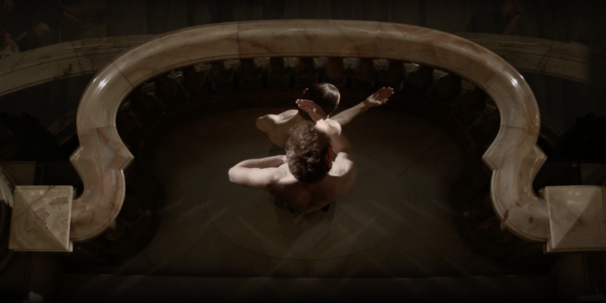

# Scripted performances: designing performative architectures through digital and absurd machines


## A PhD thesis in Architectural Design <br>by Oliver Matthew Palmer <br>Bartlett School of Architecture, University College London



```
Version 1.1
November 2017

Reformatted for web September 2021
```

Note: This is the digital version of this thesis, made to facilitate easier reading of the thesis and embedding of videos which the original PDF wouldn't allow. However, for a copy that you can cite in academic literature, a PDF version can be downloaded from the British Library / UCL website [here](https://ethos.bl.uk/OrderDetails.do?uin=uk.bl.ethos.747040).

The research within this thesis was funded by an [Arts and Humanities Research Council](https://ahrc.ukri.org) studentship, and has recently been made open access.

This doctoral thesis © copyright Oliver Matthew Palmer 2017.
