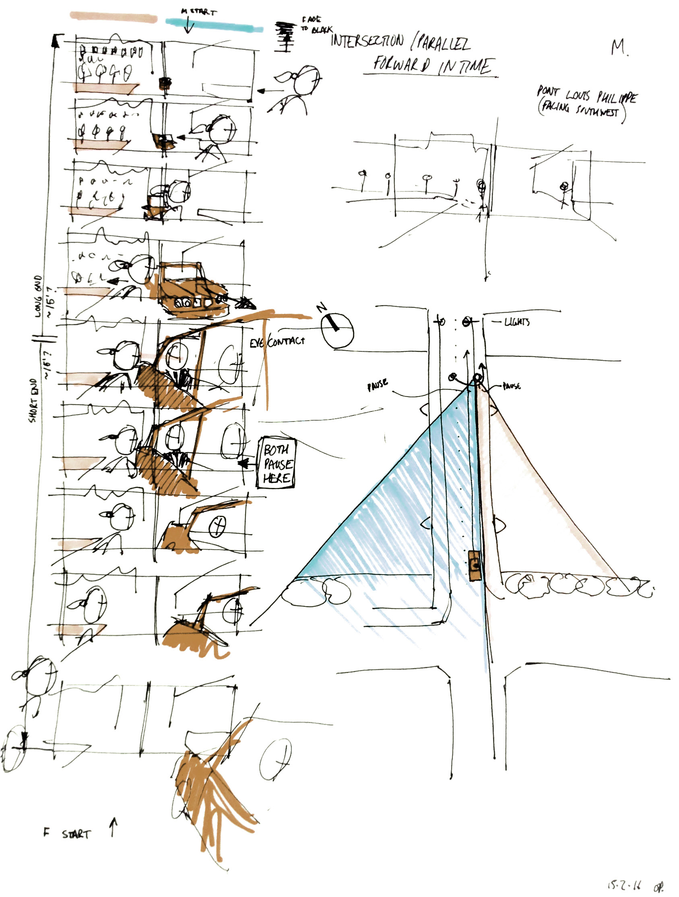

<h1>Scripted performances: designing performative architectures through digital and absurd machines</h1>


<h2>A PhD thesis in Architectural Design <br>by Oliver Matthew Palmer <br>Bartlett School of Architecture, University College London</h2>


```
Based on PhD version 1.1
November 2017

Reformatted for web January 2022
```





## Notes

This thesis has been reformatted for display on the internet. If you want to cite anything from here, I strongly recommend using the PDF version which can be downloaded from the British Library / UCL Explore [here](https://ethos.bl.uk/OrderDetails.do?uin=uk.bl.ethos.747040).

The research within this thesis was funded by an [Arts and Humanities Research Council](https://ahrc.ukri.org) studentship, and is open access.

This doctoral thesis © copyright Oliver Matthew Palmer 2017; images and videos by other authors contained within remain the copyright of their respective owners.
